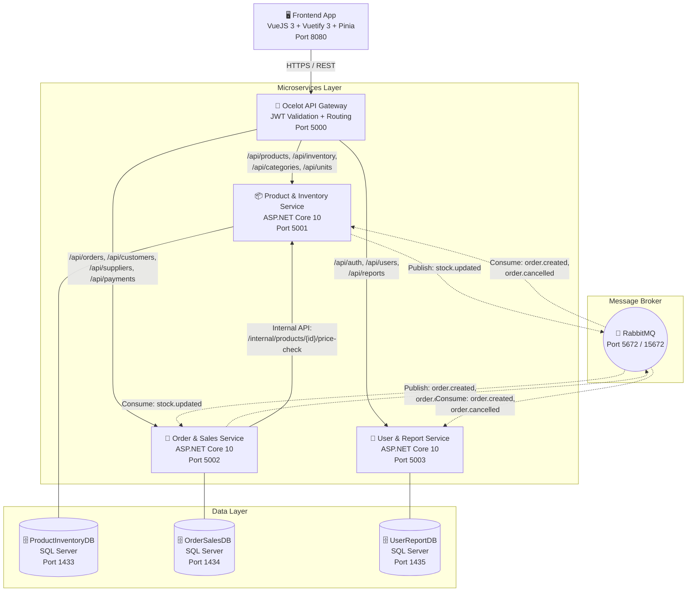

# Kiến trúc Tổng quan: Hệ thống Quản lý Bán hàng & Kho hàng

Tài liệu này mô tả kiến trúc tổng thể cho "Đề tài 01: Hệ thống quản lý bán hàng & kho hàng" theo kiến trúc Microservices.

## 1. Mục tiêu hệ thống

Xây dựng một nền tảng quản lý toàn bộ hoạt động bán lẻ nội bộ cho cửa hàng hoặc doanh nghiệp vừa và nhỏ. Hệ thống giúp:
- Quản lý danh mục sản phẩm, đơn vị tính, theo dõi tồn kho và cảnh báo tự động (tồn kho thấp / quá nhiều).
- Xử lý đơn bán hàng, chiết khấu, quản lý khách hàng, nhà cung cấp, công nợ và thanh toán từng phần.
- Quản lý tài khoản, phân quyền, nhật ký hoạt động và cung cấp Dashboard báo cáo doanh thu trực quan bằng Chart.js.

## 2. Công nghệ sử dụng

| Thành phần | Công nghệ | Phiên bản |
|---|---|---|
| Backend API | ASP.NET Core Web API | .NET 10 |
| Frontend | VueJS 3 + Vuetify 3 | Vue 3 |
| State Management | Pinia | 2.x |
| Database | SQL Server | 2022 |
| API Gateway | Ocelot | Latest |
| Message Broker | RabbitMQ | 3-management |
| Auth | JWT Bearer Token | — |
| API Docs | Swagger / Swashbuckle | — |
| Container | Docker + Docker Compose | Latest |
| Biểu đồ Frontend | Chart.js | 4.x |

## 3. Phân quyền Người dùng (Roles)

Hệ thống sử dụng xác thực **JWT (JSON Web Token)** với cơ chế **Access Token + Refresh Token**. Có 3 vai trò chính:

| Vai trò | JWT Role | Quyền hạn |
|---|---|---|
| **Admin** | `Admin` | Toàn quyền: quản lý hệ thống, xem báo cáo tổng hợp, biểu đồ doanh thu, quản lý tài khoản người dùng. |
| **Nhân viên bán hàng** | `Sales` | Tạo đơn bán hàng, quản lý khách hàng, ghi nhận thanh toán, tra cứu sản phẩm. |
| **Thủ kho** | `Warehouse` | Quản lý nhập hàng (phiếu nhập), cập nhật và theo dõi tồn kho, quản lý danh mục sản phẩm. |

## 4. Kiến trúc Microservices

Hệ thống gồm 3 Microservices độc lập, 1 API Gateway, 1 Message Broker và 1 Frontend:

### 4.1 Trách nhiệm từng thành phần

| Thành phần | Trách nhiệm | Nhóm phụ trách |
|---|---|---|
| **Frontend (VueJS 3)** | Giao diện người dùng duy nhất. Gọi API qua Gateway. Quản lý state với Pinia. Biểu đồ doanh thu bằng Chart.js. | Chung (3 nhóm) |
| **Ocelot API Gateway** | Điểm vào duy nhất. Xác thực JWT, phân giải route, rate limiting. | Chung |
| **Product & Inventory Service** | CRUD sản phẩm, danh mục (cây cha-con), đơn vị tính. Quản lý tồn kho, cảnh báo ngưỡng. Phiếu nhập kho. Lịch sử biến động kho. Publish `stock.updated`. | **Nhóm 1** |
| **Order & Sales Service** | Tạo đơn bán hàng, chiết khấu. Quản lý khách hàng, nhà cung cấp, công nợ. Thanh toán từng phần. Publish `order.created`, `order.cancelled`. | **Nhóm 2** |
| **User & Report Service** | JWT Auth (Access + Refresh Token). Quản lý tài khoản, phân quyền. Nhật ký hoạt động. Dashboard báo cáo: doanh thu ngày/tháng, top sản phẩm, top khách hàng. | **Nhóm 3** |
| **RabbitMQ** | Message Broker xử lý giao tiếp bất đồng bộ giữa các service (Topic Exchange). | Chung |

## 5. Nguyên tắc Thiết kế Bắt buộc

### 5.1 Database per Service
Mỗi service có database SQL Server riêng. **KHÔNG** share database, **KHÔNG** sử dụng Foreign Key cứng chéo service. Thay vào đó, sử dụng **Reference ID** (plain column) kèm **snapshot** dữ liệu quan trọng.

### 5.2 Giao tiếp Đồng bộ (Synchronous — REST)
Khi một service cần dữ liệu realtime từ service khác, nó gọi API nội bộ (Internal API). Ví dụ: Order & Sales Service gọi `Product & Inventory Service /internal/products/{id}/price-check` để lấy giá bán và kiểm tra tồn kho trước khi tạo đơn.

### 5.3 Giao tiếp Bất đồng bộ (Asynchronous — RabbitMQ)
Khi một service cần thông báo cho service khác mà không cần response ngay. Ví dụ: Order & Sales Service publish `order.created`, Product & Inventory Service consume event này để trừ kho.

### 5.4 Single Auth Point
`User & Report Service` là nơi duy nhất cấp JWT Token (Access + Refresh). Các service khác chỉ validate token bằng **shared secret key**.

### 5.5 Snapshot Strategy
Khi lưu Reference ID chéo service, luôn lưu kèm các thông tin hiển thị (tên, mã) dưới dạng snapshot. Ví dụ: `OrderDetail` lưu cả `ProductId`, `ProductName`, `UnitPrice` để hiển thị mà không cần gọi API chéo.

### 5.6 CORS Policy
Hệ thống áp dụng chính sách CORS thống nhất tại API Gateway, chỉ cho phép các nguồn đáng tin cậy (như Frontend VueJS chạy tại `http://localhost:8080`) thực hiện các cuộc gọi API.

### 5.7 Health Check Endpoint
Mỗi Microservice và API Gateway đều cung cấp hai endpoint tiêu chuẩn:
- `/health/live`: Liveness probe phục vụ giám sát container đang hoạt động.
- `/health/ready`: Readiness probe phục vụ kiểm tra kết nối CSDL và RabbitMQ trước khi tiếp nhận request.

---

## 6. Cấu trúc Mã nguồn Thống nhất (Project Structure)

Mỗi service .NET trong hệ thống tuân thủ cấu trúc thư mục 3 lớp sau:
- **Presentation Layer (`.API`)**: Chứa Controllers, Middlewares và cấu hình Program.cs.
- **Application Layer (`.Application`)**: Định nghĩa DTOs, Interfaces, Service Logic và Automapper profiles.
- **Infrastructure Layer (`.Infrastructure`)**: Chứa DB Context, Entities, Repositories, Migrations và các RabbitMQ Consumer/Publisher.

---

## 7. Luồng xử lý chính

### 7.1 Luồng Đăng nhập
1. User nhập username/password trên Frontend.
2. Frontend gọi `POST /api/auth/login` qua Gateway.
3. User & Report Service xác thực, cấp Access Token (15 phút) + Refresh Token (7 ngày).
4. Frontend lưu token vào Pinia store, gửi kèm header `Authorization: Bearer <token>` cho mọi request sau.

### 7.2 Luồng Bán hàng
1. Nhân viên Sales chọn sản phẩm, nhập số lượng trên Frontend.
2. Frontend gọi `POST /api/orders` qua Gateway.
3. Order & Sales Service gọi nội bộ Product & Inventory Service để kiểm tra giá và tồn kho.
4. Order & Sales Service tạo đơn, lưu DB, publish `order.created`.
5. Product & Inventory Service consume event → trừ kho → publish `stock.updated`.
6. User & Report Service consume event → cập nhật Dashboard.

### 7.3 Luồng Nhập kho
1. Thủ kho tạo phiếu nhập (Draft) trên Frontend.
2. Sau khi kiểm tra, thủ kho xác nhận phiếu nhập.
3. Product & Inventory Service cập nhật tồn kho, ghi lịch sử biến động, publish `stock.updated`.
4. Order & Sales Service consume event → cập nhật cache tồn kho.

### 7.4 Luồng Trả hàng (Return Order Flow)
1. Khách hàng mang hàng trả lại toàn bộ hoặc một phần.
2. Nhân viên Sales kiểm tra đơn gốc và tạo phiếu trả qua API `POST /api/orders/{id}/return`.
3. Order & Sales Service tạo bản ghi `ReturnOrder` & `ReturnOrderDetail`, trừ công nợ khách hàng (hoặc ghi nhận hoàn tiền) và publish event `order.returned`.
4. Product & Inventory Service consume `order.returned` -> cộng lại tồn kho, ghi nhận `InventoryTransaction` loại `Return`, publish `stock.updated`.
5. User & Report Service consume `order.returned` -> trừ doanh số trong `DailySalesSummary` & `MonthlySalesSummary`.

### 7.5 Luồng Hủy đơn hàng (Cancel Order Flow)
1. Người dùng có thẩm quyền thực hiện hủy đơn hàng (trước khi giao hàng thành công) qua API `PUT /api/orders/{id}/cancel`.
2. Order & Sales Service cập nhật trạng thái đơn thành `Cancelled`, ghi log vào `OrderStatusHistory`, cập nhật công nợ của khách hàng, publish event `order.cancelled`.
3. Product & Inventory Service consume `order.cancelled` -> cộng lại tồn kho và ghi nhận giao dịch hoàn kho.
4. User & Report Service consume `order.cancelled` -> trừ doanh số báo cáo.

