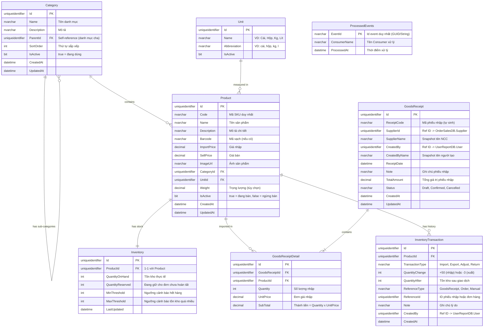
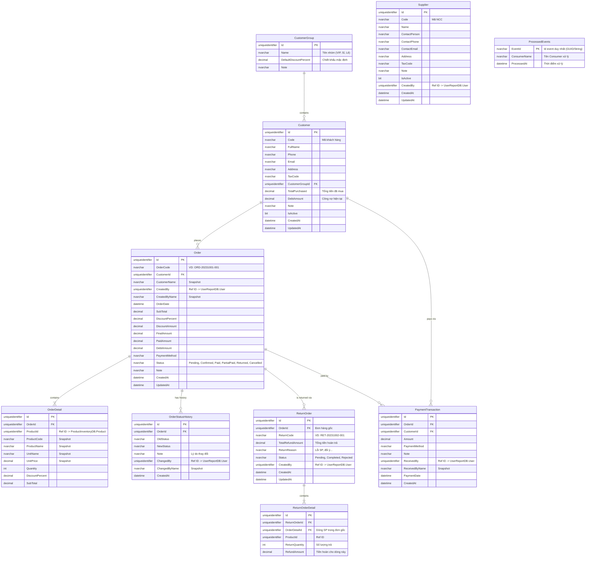

# Thiết kế Cơ sở dữ liệu (Database Design)

Tài liệu này mô tả chi tiết thiết kế CSDL cho 3 Microservices độc lập trong Đề tài 01.
Theo nguyên tắc **Database per service**, mỗi Service sẽ sở hữu và quản trị một CSDL riêng biệt, không có bất kỳ Foreign Key cứng nào liên kết giữa các CSDL này. Sự liên kết (nếu có) sẽ được thể hiện qua các cột Reference ID.

> **Quy ước chung:**
> - Tất cả Primary Key sử dụng `uniqueidentifier` (GUID) để tránh conflict khi merge dữ liệu.
> - Các trường `CreatedAt`, `UpdatedAt` có mặt ở hầu hết các bảng để phục vụ audit trail.
> - Soft-delete được áp dụng qua trường `IsActive` / `IsDeleted` thay vì xóa cứng dữ liệu.
> - Các cột Reference ID (tham chiếu chéo service) được ghi chú rõ ràng, KHÔNG tạo FK cứng.

---

## 1. Product & Inventory Service (`ProductInventoryDB`)

Database này chịu trách nhiệm lưu trữ thông tin sản phẩm, danh mục, đơn vị tính, quản lý số lượng tồn kho, lịch sử nhập kho và lịch sử biến động kho.

### 1.1 Lược đồ ERD



### 1.2 Giải thích thiết kế

| Bảng | Mục đích |
|------|----------|
| `Category` | Phân loại sản phẩm theo cấu trúc cây cha-con (self-referencing). VD: Điện tử → Laptop → Laptop Gaming. |
| `Unit` | Quản lý đơn vị tính. Tách thành bảng riêng để tái sử dụng và nhất quán. |
| `Product` | Thông tin sản phẩm. Có `IsActive` để soft-delete (ngừng bán mà không xóa). Có `Barcode` để mở rộng cho việc quét mã vạch. |
| `Inventory` | Tồn kho. Tách riêng khỏi `Product` để cập nhật tồn kho không lock bảng Product. Có `QuantityReserved` cho trường hợp đơn hàng đang xử lý (giữ hàng). Có cả `MinThreshold` và `MaxThreshold` để cảnh báo 2 chiều. |
| `GoodsReceipt` | Phiếu nhập kho. Có snapshot `SupplierName`, `CreatedByName` để hiển thị mà không cần gọi API chéo service. |
| `GoodsReceiptDetail` | Chi tiết từng sản phẩm trong phiếu nhập. |
| `InventoryTransaction` | Lịch sử biến động kho (nhập, xuất, điều chỉnh, trả hàng). Giúp truy vết mọi thay đổi tồn kho và phục vụ đối soát. |
| `ProcessedEvents` | **Bảng mới** — Lưu vết các event đã được xử lý thành công để đảm bảo tính **Idempotency** (chống trùng lặp message khi RabbitMQ gửi lại). |

**Ghi chú Reference ID chéo service:**
- `SupplierId` trong `GoodsReceipt` → tham chiếu logic đến bảng `Supplier` trong `OrderSalesDB`.
- `CreatedBy` trong `GoodsReceipt` và `InventoryTransaction` → tham chiếu logic đến bảng `User` trong `UserReportDB`.

---

## 2. Order & Sales Service (`OrderSalesDB`)

Database này lưu trữ thông tin các giao dịch bán hàng, đơn hàng, khách hàng, nhà cung cấp, công nợ, lịch sử thanh toán và quy trình trả hàng.

### 2.1 Lược đồ ERD



### 2.2 Giải thích thiết kế

| Bảng | Mục đích |
|------|----------|
| `CustomerGroup` | **Bảng mới** — Phân loại khách hàng (VIP, Sỉ, Lẻ) để tự động áp dụng `DefaultDiscountPercent` khi tạo đơn. |
| `Customer` | Mở rộng thêm `CustomerGroupId` để liên kết nhóm. |
| `Supplier` | Bổ sung `CreatedBy` và `UpdatedAt` phục vụ audit trail. |
| `Order` | Thêm trạng thái `Returned`. Hỗ trợ quy trình bán hàng linh hoạt. |
| `OrderStatusHistory` | **Bảng mới** — Lưu vết mọi thay đổi trạng thái của đơn hàng (ai duyệt, ai hủy, thời gian nào). Bắt buộc cho audit. |
| `ReturnOrder` & `ReturnOrderDetail` | **Bảng mới** — Xử lý quy trình trả hàng (hoàn tiền, hoàn kho). Liên kết trực tiếp tới `OrderId` và `OrderDetailId` gốc để đối chiếu số lượng trả không vượt quá số lượng mua. |
| `PaymentTransaction` | Ghi nhận mỗi lần khách thanh toán. |
| `ProcessedEvents` | **Bảng mới** — Đảm bảo tính **Idempotency** khi consume các stock events chéo service. |

**Ghi chú Reference ID chéo service:**
- `ProductId` trong `OrderDetail`, `ReturnOrderDetail` → tham chiếu đến `ProductInventoryDB`.
- `CreatedBy`, `ChangedBy`, `ReceivedBy` → tham chiếu đến `UserReportDB`.

---

## 3. User & Report Service (`UserReportDB`)

Database này phục vụ việc xác thực, phân quyền, quản lý phiên đăng nhập và lưu trữ các view dữ liệu tổng hợp từ event (RabbitMQ) để phục vụ Dashboard báo cáo mà không cần query chéo DB.

### 3.1 Lược đồ ERD

```mermaid
erDiagram
    User {
        uniqueidentifier Id PK
        nvarchar Username "Tên đăng nhập (unique)"
        nvarchar PasswordHash "Mật khẩu mã hóa"
        nvarchar FullName
        nvarchar Email
        nvarchar Phone
        nvarchar AvatarUrl "Ảnh đại diện"
        nvarchar Role "Admin, Sales, Warehouse"
        bit IsActive "true = đang hoạt động"
        datetime LastLoginAt "Lần đăng nhập gần nhất"
        datetime CreatedAt
        datetime UpdatedAt
    }

    RefreshToken {
        uniqueidentifier Id PK
        uniqueidentifier UserId FK
        nvarchar Token "Refresh Token string"
        datetime ExpiresAt "Thời điểm hết hạn"
        datetime CreatedAt
        nvarchar CreatedByIp "IP tạo token"
        datetime RevokedAt "null = chưa thu hồi"
        nvarchar RevokedByIp "IP thu hồi"
        nvarchar ReplacedByToken "Token thay thế (khi rotate)"
    }

    ActivityLog {
        uniqueidentifier Id PK
        uniqueidentifier UserId FK
        nvarchar Action "Login, Logout, CreateOrder, ImportGoods..."
        nvarchar EntityType "Order, Product, GoodsReceipt..."
        nvarchar EntityId "ID của đối tượng bị tác động"
        nvarchar Description "Mô tả hành động"
        nvarchar IpAddress
        datetime CreatedAt
    }

    DailySalesSummary {
        uniqueidentifier Id PK
        date ReportDate "Ngày báo cáo"
        int TotalOrders "Tổng số đơn hàng"
        decimal TotalRevenue "Tổng doanh thu"
        decimal TotalDiscount "Tổng chiết khấu"
        int TotalItemsSold "Tổng sản phẩm bán ra"
        datetime LastUpdated
    }

    MonthlySalesSummary {
        uniqueidentifier Id PK
        int Year
        int Month
        int TotalOrders
        decimal TotalRevenue
        decimal TotalDiscount
        int TotalItemsSold
        int TotalNewCustomers "Khách mới trong tháng"
        datetime LastUpdated
    }

    TopProductSummary {
        uniqueidentifier Id PK
        uniqueidentifier ProductId "Ref ID -> ProductInventoryDB.Product"
        nvarchar ProductCode "Snapshot"
        nvarchar ProductName "Snapshot"
        int TotalQuantitySold
        decimal TotalRevenueGenerated
        int Year
        int Month
        datetime LastUpdated
    }

    TopCustomerSummary {
        uniqueidentifier Id PK
        uniqueidentifier CustomerId "Ref ID -> OrderSalesDB.Customer"
        nvarchar CustomerName "Snapshot"
        nvarchar CustomerPhone "Snapshot"
        int TotalOrders
        decimal TotalSpent "Tổng chi tiêu"
        int Year
        int Month
        datetime LastUpdated
    }

    ProcessedEvents {
        nvarchar EventId PK "Id event duy nhất (GUID/String)"
        nvarchar ConsumerName "Tên Consumer xử lý"
        datetime ProcessedAt "Thời điểm xử lý"
    }

    User ||--o{ RefreshToken : "has tokens"
    User ||--o{ ActivityLog : "has logs"
```



### 3.2 Giải thích thiết kế

| Bảng | Mục đích |
|------|----------|
| `User` | Thêm `Email`, `Phone`, `AvatarUrl`, `LastLoginAt` cho đầy đủ thông tin profile. |
| `RefreshToken` | **Bảng mới** — Hoàn chỉnh luồng JWT Auth. Lưu Refresh Token để cấp lại Access Token mà không cần đăng nhập lại. Hỗ trợ token rotation và revoke token. |
| `ActivityLog` | **Bảng mới** — Nhật ký hoạt động. Ghi lại mọi thao tác quan trọng (đăng nhập, tạo đơn, nhập kho...) phục vụ audit trail và bảo mật. |
| `DailySalesSummary` | Thêm `TotalDiscount`, `TotalItemsSold` để báo cáo chi tiết hơn. |
| `MonthlySalesSummary` | **Bảng mới** — Tổng hợp doanh thu theo tháng. Đáp ứng yêu cầu *"Dashboard: doanh thu tuần/tháng"*. Có thêm `TotalNewCustomers`. |
| `TopProductSummary` | Thêm `ProductCode`, phân chia theo `Year/Month` thay vì `ReportDate` để tổng hợp hiệu quả hơn. |
| `TopCustomerSummary` | **Bảng mới** — Đáp ứng yêu cầu *"Top khách hàng theo doanh số"*. Phân chia theo `Year/Month`. |
| `ProcessedEvents` | **Bảng mới** — Đảm bảo tính **Idempotency** khi consume các order/stock events để tạo báo cáo tổng hợp. |

**Cơ chế Tổng hợp Báo cáo (CQRS / Event-driven):**
- Khi `Order & Sales Service` tạo đơn thành công → publish event `order.created`.
- `User & Report Service` consume event này và:
  1. Kiểm tra bảng `ProcessedEvents` xem `eventId` đã được xử lý chưa (Idempotency Check). Nếu đã xử lý, bỏ qua.
  2. Nếu chưa xử lý, cộng dồn vào `DailySalesSummary` (theo ngày).
  3. Cộng dồn vào `MonthlySalesSummary` (theo tháng).
  4. Cập nhật `TopProductSummary` (top sản phẩm bán chạy).
  5. Cập nhật `TopCustomerSummary` (top khách hàng).
  6. Ghi log vào `ActivityLog`.
  7. Ghi nhận `eventId` vào bảng `ProcessedEvents`.

> Việc tách sẵn các bảng Summary giúp Dashboard render cực nhanh (chỉ cần SELECT đơn giản) mà không cần phải tính toán phức tạp từ đơn hàng gốc — đó chính là ý tưởng cốt lõi của mô hình **CQRS (Command Query Responsibility Segregation)**.

---

## 4. Tổng hợp tham chiếu chéo Service (Cross-Service References)

Bảng dưới đây liệt kê toàn bộ các Reference ID trong hệ thống — đây là các cột **KHÔNG CÓ Foreign Key cứng** mà chỉ lưu giá trị ID dạng plain column:

| Database nguồn | Bảng.Cột | Tham chiếu đến | Cách xử lý |
|---|---|---|---|
| ProductInventoryDB | `GoodsReceipt.SupplierId` | OrderSalesDB → `Supplier.Id` | Lưu kèm `SupplierName` snapshot |
| ProductInventoryDB | `GoodsReceipt.CreatedBy` | UserReportDB → `User.Id` | Lưu kèm `CreatedByName` snapshot |
| ProductInventoryDB | `InventoryTransaction.CreatedBy` | UserReportDB → `User.Id` | Gọi API nội bộ nếu cần tên |
| OrderSalesDB | `OrderDetail.ProductId` | ProductInventoryDB → `Product.Id` | Lưu kèm snapshot `ProductCode`, `ProductName`, `UnitPrice` |
| OrderSalesDB | `Order.CreatedBy` | UserReportDB → `User.Id` | Lưu kèm `CreatedByName` snapshot |
| OrderSalesDB | `PaymentTransaction.ReceivedBy` | UserReportDB → `User.Id` | Lưu kèm `ReceivedByName` snapshot |
| UserReportDB | `TopProductSummary.ProductId` | ProductInventoryDB → `Product.Id` | Lưu kèm snapshot `ProductCode`, `ProductName` |
| UserReportDB | `TopCustomerSummary.CustomerId` | OrderSalesDB → `Customer.Id` | Lưu kèm snapshot `CustomerName`, `CustomerPhone` |

> **Nguyên tắc Snapshot:** Mọi Reference ID chéo service đều nên lưu kèm các thông tin hiển thị (tên, mã) dưới dạng snapshot tại thời điểm tạo. Điều này giúp service có thể hiển thị dữ liệu mà **không cần gọi API chéo** trong hầu hết trường hợp.

---

## 5. Chiến lược Đánh Index (Index Strategy)

Để đảm bảo hiệu năng truy vấn cao khi dữ liệu lớn, hệ thống áp dụng các index sau:

### 5.1 ProductInventoryDB Indexes
- **Clustered Index**: Mặc định trên các khóa chính (`Product.Id`, `Category.Id`, `Unit.Id`, `GoodsReceipt.Id`, `InventoryTransaction.Id`).
- **Non-Clustered Indexes**:
  - `Product.ProductCode` (Unique) - Đẩy nhanh tốc độ tìm kiếm sản phẩm theo SKU.
  - `Product.Barcode` - Tối ưu hóa quét mã vạch bán hàng.
  - `InventoryTransaction.ProductId` + `CreatedAt` - Tối ưu hóa truy vấn lịch sử thẻ kho của một sản phẩm.

### 5.2 OrderSalesDB Indexes
- **Clustered Index**: Trên các khóa chính (`Order.Id`, `Customer.Id`, `Supplier.Id`).
- **Non-Clustered Indexes**:
  - `Order.OrderCode` (Unique) - Tra cứu đơn nhanh qua mã hóa đơn.
  - `Order.CustomerId` + `CreatedAt` - Truy vấn danh sách đơn hàng của khách hàng theo thời gian.
  - `OrderStatusHistory.OrderId` + `ChangedAt` - Truy vết lịch sử trạng thái đơn hàng.
  - `ReturnOrder.OrderId` - Tối ưu hóa đối soát khi thực hiện quy trình trả hàng.

### 5.3 UserReportDB Indexes
- **Clustered Index**: Khóa chính (`User.Id`, `DailySalesSummary.Id`, v.v.).
- **Non-Clustered Indexes**:
  - `User.Username` (Unique) - Tăng tốc xác thực khi đăng nhập.
  - `DailySalesSummary.ReportDate` (Unique) - Truy vấn biểu đồ doanh thu ngày.
  - `MonthlySalesSummary.Year` + `MonthlySalesSummary.Month` (Unique) - Tối ưu hóa báo cáo tháng.
  - `ProcessedEvents.EventId` (Unique) - Phục vụ kiểm tra Idempotency cực nhanh trước khi consume bất kỳ message nào.

---

## 6. Chiến lược Cập nhật CSDL (Database Migration Strategy)

Hệ thống sử dụng **Entity Framework Core (EF Core) Migrations** để quản lý phiên bản cơ sở dữ liệu.

### 6.1 Quy trình phát triển (Development Flow)
1. Khi có thay đổi về Entity/Model trong code, sinh viên tạo Migration mới thông qua terminal:
   ```bash
   dotnet ef migrations add <MigrationName> --project <Service.Infrastructure> --startup-project <Service.API>
   ```
2. Kiểm tra file migration sinh ra trong thư mục `/Migrations` để đảm bảo code SQL tự sinh chính xác.
3. Chạy lệnh để cập nhật DB local:
   ```bash
   dotnet ef database update --project <Service.Infrastructure> --startup-project <Service.API>
   ```

### 6.2 Quy trình triển khai (Production/Docker Flow)
- Để tránh xung đột khi scale-out (nhiều bản sao service cùng khởi chạy và cập nhật database), hệ thống thực hiện migration theo một trong hai cách:
  - **Cách 1 (Khuyến nghị cho Lab/Dev)**: Tự động chạy migration tại hàm `Program.cs` ở thời điểm khởi chạy container:
    ```csharp
    using (var scope = app.Services.CreateScope())
    {
        var db = scope.ServiceProvider.GetRequiredService<ApplicationDbContext>();
        db.Database.Migrate();
    }
    ```
  - **Cách 2 (Enterprise)**: Xuất file SQL script từ migration và chạy độc lập trên CD pipeline hoặc SQL container init-script trước khi khởi động các API container:
    ```bash
    dotnet ef migrations script -o migration.sql
    ```

