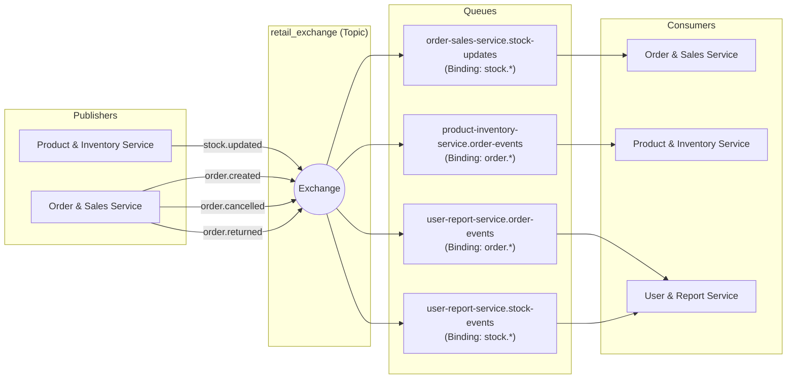
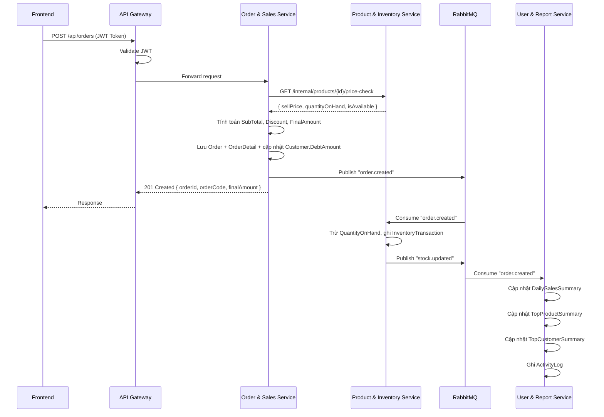
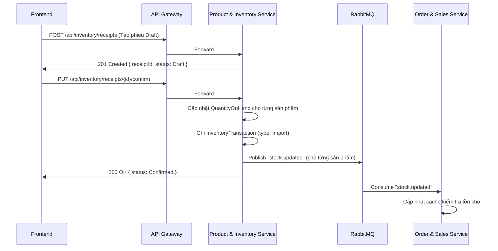

# Thiết kế Event-Driven (Message Broker)

Tài liệu này định nghĩa cơ chế giao tiếp bất đồng bộ giữa các Microservices bằng **RabbitMQ** (mô hình Publish/Subscribe).

## 1. Mục tiêu

- **Giảm coupling:** Các service không gọi trực tiếp lẫn nhau cho các tác vụ không cần response ngay.
- **Tăng fault tolerance:** Nếu User & Report Service bị down, Order & Sales Service vẫn có thể tạo đơn hàng. Các event được lưu trong Queue và xử lý khi service up lại.
- **CQRS / Read Model:** User & Report Service xây dựng các bảng Summary (read model) từ event, giúp Dashboard render cực nhanh.

## 2. Kiến trúc RabbitMQ

### 2.1 Exchange & Queue

Hệ thống sử dụng **Topic Exchange** tên `retail_exchange` để điều hướng message dựa trên routing key.



### 2.2 Bảng tổng hợp Routing

| Routing Key | Publisher | Consumer(s) | Mục đích |
|---|---|---|---|
| `stock.updated` | Product & Inventory Service | Order & Sales Service, User & Report Service | Thông báo tồn kho thay đổi |
| `order.created` | Order & Sales Service | Product & Inventory Service, User & Report Service | Thông báo đơn hàng mới được tạo |
| `order.cancelled` | Order & Sales Service | Product & Inventory Service, User & Report Service | Thông báo đơn hàng bị hủy |
| `order.returned` | Order & Sales Service | Product & Inventory Service, User & Report Service | Thông báo khách trả lại hàng |
| `payment.received` | Order & Sales Service | User & Report Service | Thông báo ghi nhận thanh toán (công nợ / từng phần) |

---

## 3. Chi tiết các Events

### 3.1 Event: `stock.updated`

- **Publisher:** `Product & Inventory Service`
- **Khi nào phát:** Khi số lượng tồn kho thay đổi (nhập kho, điều chỉnh thủ công, trả hàng).
- **Consumers:**
  - **Order & Sales Service:** Cập nhật cache/logic kiểm tra hàng còn hay hết, ngăn bán sản phẩm đã hết hàng.
  - **User & Report Service:** Cập nhật Dashboard cảnh báo tồn kho thấp (nếu có).

```json
{
  "eventId": "evt-1001",
  "eventType": "stock.updated",
  "timestamp": "2023-10-01T10:00:00Z",
  "data": {
    "productId": "prod-1",
    "productCode": "SKU001",
    "productName": "Laptop Dell XPS 15",
    "previousQuantity": 10,
    "newQuantity": 60,
    "changeAmount": 50,
    "changeReason": "Import",
    "referenceId": "receipt-001",
    "isAvailable": true,
    "isBelowMinThreshold": false
  }
}
```

### 3.2 Event: `order.created`

- **Publisher:** `Order & Sales Service`
- **Khi nào phát:** Ngay sau khi một đơn hàng được tạo thành công (trạng thái Paid hoặc PartialPaid).
- **Consumers:**
  - **Product & Inventory Service:** Trừ tồn kho (`QuantityOnHand`), ghi `InventoryTransaction` (type = `Export`).
  - **User & Report Service:** Cộng dồn doanh thu vào `DailySalesSummary`, `MonthlySalesSummary`, cập nhật `TopProductSummary`, `TopCustomerSummary`, ghi `ActivityLog`.

```json
{
  "eventId": "evt-2001",
  "eventType": "order.created",
  "timestamp": "2023-10-01T10:15:00Z",
  "data": {
    "orderId": "ord-1",
    "orderCode": "ORD-20231001-001",
    "customerId": "cust-1",
    "customerName": "Nguyễn Văn A",
    "createdBy": "guid-001",
    "createdByName": "Nhân viên Sales 01",
    "orderDate": "2023-10-01T10:15:00Z",
    "subTotal": 27400000,
    "discountAmount": 1370000,
    "finalAmount": 26030000,
    "paidAmount": 24500000,
    "status": "PartialPaid",
    "items": [
      {
        "productId": "prod-1",
        "productCode": "SKU001",
        "productName": "Laptop Dell XPS 15",
        "unitPrice": 25000000,
        "quantity": 1,
        "subTotal": 25000000
      },
      {
        "productId": "prod-2",
        "productCode": "SKU002",
        "productName": "Chuột Logitech MX",
        "unitPrice": 1800000,
        "quantity": 2,
        "subTotal": 2400000
      }
    ]
  }
}
```

### 3.3 Event: `order.cancelled`

- **Publisher:** `Order & Sales Service`
- **Khi nào phát:** Khi Admin hủy một đơn hàng đã tạo.
- **Consumers:**
  - **Product & Inventory Service:** Hoàn lại tồn kho (cộng lại `QuantityOnHand`), ghi `InventoryTransaction` (type = `Return`).
  - **User & Report Service:** Trừ doanh thu khỏi `DailySalesSummary`, `MonthlySalesSummary`, cập nhật lại `TopProductSummary`, `TopCustomerSummary`.

```json
{
  "eventId": "evt-3001",
  "eventType": "order.cancelled",
  "timestamp": "2023-10-01T14:00:00Z",
  "data": {
    "orderId": "ord-1",
    "orderCode": "ORD-20231001-001",
    "customerId": "cust-1",
    "cancelledBy": "guid-admin",
    "cancelledByName": "Nguyễn Admin",
    "reason": "Khách hàng đổi ý",
    "originalFinalAmount": 26030000,
    "items": [
      { "productId": "prod-1", "quantity": 1 },
      { "productId": "prod-2", "quantity": 2 }
    ]
  }
}
```

### 3.4 Event: `order.returned`

- **Publisher:** `Order & Sales Service`
- **Khi nào phát:** Khi khách hàng trả lại một phần hoặc toàn bộ đơn hàng.
- **Consumers:**
  - **Product & Inventory Service:** Nhận lại hàng vào kho (cộng `QuantityOnHand`), ghi `InventoryTransaction` (type = `Return`).
  - **User & Report Service:** Trừ doanh thu tương ứng với số tiền hoàn trả khỏi `DailySalesSummary`, `MonthlySalesSummary`, cập nhật lại `TopProductSummary`.

```json
{
  "eventId": "evt-4001",
  "eventType": "order.returned",
  "timestamp": "2023-10-02T09:00:00Z",
  "data": {
    "returnOrderId": "ret-1",
    "orderId": "ord-1",
    "orderCode": "ORD-20231001-001",
    "customerId": "cust-1",
    "totalRefundAmount": 25000000,
    "items": [
      { "productId": "prod-1", "returnQuantity": 1, "refundAmount": 25000000 }
    ]
  }
}
```

### 3.5 Event: `payment.received`

- **Publisher:** `Order & Sales Service`
- **Khi nào phát:** Khi khách hàng trả bớt nợ hoặc thanh toán một phần tiền của đơn hàng.
- **Consumers:**
  - **User & Report Service:** Cập nhật công nợ của khách hàng trong TopCustomerSummary và ghi nhận lịch sử giao dịch thanh toán trong hệ thống báo cáo.

```json
{
  "eventId": "evt-5001",
  "eventType": "payment.received",
  "timestamp": "2023-10-02T10:00:00Z",
  "data": {
    "paymentTransactionId": "pay-txn-001",
    "orderId": "ord-1",
    "orderCode": "ORD-20231001-001",
    "customerId": "cust-1",
    "customerName": "Nguyễn Văn A",
    "amount": 1530000,
    "paymentMethod": "BankTransfer",
    "note": "Khách trả nợ đợt 2",
    "receivedBy": "guid-sales-01",
    "receivedByName": "Nhân viên Sales 01"
  }
}
```

---

## 4. Luồng xử lý End-to-End

### 4.1 Luồng Bán hàng (Happy Path)



### 4.2 Luồng Nhập kho



---

## 5. Cơ chế Xử lý Lỗi

### 5.1 Retry Policy
- Mỗi consumer sẽ retry tối đa **3 lần** với khoảng cách tăng dần (exponential backoff): 1s → 5s → 30s.
- Sử dụng `Polly` library trong .NET hoặc cấu hình retry trực tiếp trên RabbitMQ consumer.

### 5.2 Dead Letter Queue (DLQ)
- Sau 3 lần retry thất bại, message sẽ được chuyển vào **Dead Letter Queue** (DLQ).
- Mỗi consumer queue có một DLQ tương ứng:
  - `order-sales-service.stock-updates.dlq`
  - `product-inventory-service.order-events.dlq`
  - `user-report-service.order-events.dlq`
- Admin có thể kiểm tra DLQ qua RabbitMQ Management UI (`http://localhost:15672`).

### 5.3 Idempotency (Xử lý trùng lặp)
- Mỗi event có `eventId` duy nhất.
- Consumer phải kiểm tra `eventId` đã được xử lý chưa trước khi thực thi (lưu vào bảng `ProcessedEvents`). Điều này đảm bảo event được xử lý **đúng 1 lần** ngay cả khi message bị gửi lại.
- **Lược đồ Bảng `ProcessedEvents`:**
  ```sql
  CREATE TABLE ProcessedEvents (
      EventId NVARCHAR(100) PRIMARY KEY, -- GUID hoặc mã định danh của event
      ConsumerName NVARCHAR(250) NOT NULL, -- Tên Consumer lớp xử lý
      ProcessedAt DATETIME NOT NULL DEFAULT GETDATE() -- Thời điểm xử lý xong
  );
  ```
- **Thuật toán xử lý tại Consumer:**
  1. Nhận message từ Queue, giải mã lấy `eventId`.
  2. Bắt đầu một database Transaction.
  3. Kiểm tra xem `eventId` đã tồn tại trong bảng `ProcessedEvents` chưa.
  4. Nếu có: Bỏ qua việc xử lý (Acknowledge message và kết thúc).
  5. Nếu chưa có: Thực hiện logic nghiệp vụ chính (VD: trừ kho) -> Chèn `eventId` mới vào `ProcessedEvents` -> Commit Transaction -> Acknowledge message.

### 5.4 Tắt máy An toàn (Graceful Shutdown)
Khi container hoặc service bị dừng (do deploy phiên bản mới hoặc hạ tầng restart), các Consumer đang xử lý dở các message từ RabbitMQ phải được đảm bảo tắt an toàn để không mất mát dữ liệu:
- Khi nhận tín hiệu dừng ứng dụng (`SIGTERM` hoặc `SIGINT`), Consumer sẽ ngừng nhận message mới từ RabbitMQ ngay lập tức.
- Chờ tối đa **10 giây** để hoàn thành các message đang xử lý dở dang dưới database.
- Sau khi hoàn thành xong hoặc hết thời gian chờ, đóng các kết nối (Channel, Connection) tới RabbitMQ một cách an toàn và thoát ứng dụng.

---

## 6. Cấu hình RabbitMQ trong `appsettings.json`

```json
{
  "RabbitMQ": {
    "HostName": "rabbitmq",
    "Port": 5672,
    "UserName": "guest",
    "Password": "guest",
    "VirtualHost": "/",
    "ExchangeName": "retail_exchange",
    "ExchangeType": "topic",
    "RetryCount": 3,
    "RetryIntervalMs": [1000, 5000, 30000]
  }
}
```
