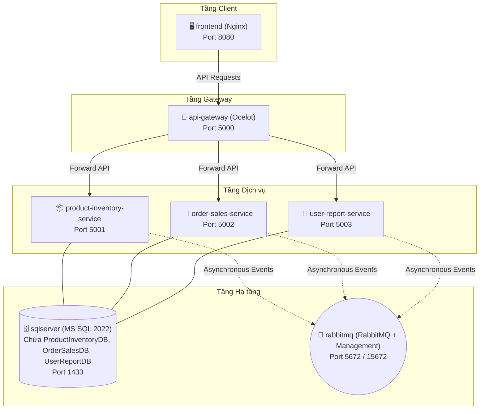

# Hướng dẫn Triển khai (Deployment Guide)

Tài liệu này hướng dẫn chi tiết cách build, run, cấu hình môi trường và khắc phục sự cố cho toàn bộ hệ thống "Quản lý bán hàng & kho hàng" bằng Docker và Docker Compose trên môi trường Phát triển (Development).

---

## 1. Yêu cầu hệ thống (Prerequisites)

- **Docker Desktop** (Dành cho Windows/Mac) hoặc Docker Engine + Docker Compose (Linux).
- Máy tính có tối thiểu **8GB RAM** (Kiến trúc đã được tối ưu hóa chạy chỉ **1 SQL Server instance** duy nhất cho cả 3 DB nên hoạt động mượt mà trên máy RAM 8GB).
- Git để clone code.

---

## 2. Kiến trúc Docker Containers (Đã tối ưu hóa RAM)

Hệ thống được cấu hình chạy tổng cộng **7 containers** trên một mạng nội bộ ảo (`retail_network`):



---

## 3. Cấu trúc và Chi tiết Tệp cấu hình Môi trường (`.env`)

Mọi tham số nhạy cảm (như mật khẩu DB, khóa bảo mật JWT) được lưu trữ tập trung tại file `.env` ở thư mục gốc để Docker Compose tự động nạp khi khởi chạy:

```ini
# ==============================================================================
# CẤU HÌNH HẠ TẦNG (INFRASTRUCTURE CONFIG)
# ==============================================================================
MSSQL_SA_PASSWORD=SuperStrong@Password123
MSSQL_PID=Developer

RABBITMQ_DEFAULT_USER=guest
RABBITMQ_DEFAULT_PASS=guest

# ==============================================================================
# BẢO MẬT & XÁC THỰC JWT
# ==============================================================================
JWT_SECRET=this-is-a-very-long-and-super-secure-secret-key-32-bytes-long!
JWT_ISSUER=RetailSystemApi
JWT_AUDIENCE=RetailSystemClient
```

---

## 4. Dockerfile Templates Chuẩn công nghiệp

Hệ thống áp dụng kỹ thuật **Multi-stage Build** để tối ưu hóa kích thước image và tăng tính bảo mật (loại bỏ SDK khỏi sản phẩm chạy cuối).

### 4.1 Dockerfile cho .NET 10 Microservices (Áp dụng chung cho Product, Order, User, Gateway)
Đặt tệp `Dockerfile` này tại thư mục con của từng service (vd: `/ProductInventoryService/Dockerfile`):

```dockerfile
# Stage 1: Build & Publish ứng dụng
FROM mcr.microsoft.com/dotnet/sdk:10.0 AS build
WORKDIR /src

# Copy file .csproj của tất cả các lớp trong service để restore dependencies trước
COPY ["ProductInventoryService.API/ProductInventoryService.API.csproj", "ProductInventoryService.API/"]
COPY ["ProductInventoryService.Application/ProductInventoryService.Application.csproj", "ProductInventoryService.Application/"]
COPY ["ProductInventoryService.Infrastructure/ProductInventoryService.Infrastructure.csproj", "ProductInventoryService.Infrastructure/"]

RUN dotnet restore "ProductInventoryService.API/ProductInventoryService.API.csproj"

# Copy toàn bộ mã nguồn còn lại và build
COPY . .
WORKDIR "/src/ProductInventoryService.API"
RUN dotnet build "ProductInventoryService.API.csproj" -c Release -o /app/build

FROM build AS publish
RUN dotnet publish "ProductInventoryService.API.csproj" -c Release -o /app/publish /p:UseAppHost=false

# Stage 2: Runtime Environment (Tối ưu dung lượng)
FROM mcr.microsoft.com/dotnet/aspnet:10.0 AS final
WORKDIR /app
COPY --from=publish /app/publish .
EXPOSE 80
ENTRYPOINT ["dotnet", "ProductInventoryService.API.dll"]
```

### 4.2 Dockerfile cho Frontend VueJS (Sử dụng Nginx làm Web Server)
Đặt tệp `Dockerfile` tại thư mục `/Frontend/Dockerfile`:

```dockerfile
# Stage 1: Build VueJS code sang Static Assets (HTML/JS/CSS)
FROM node:20-alpine AS build-stage
WORKDIR /app
COPY package*.json ./
RUN npm install
COPY . .
RUN npm run build

# Stage 2: Nginx Web Server để phục vụ static files
FROM nginx:stable-alpine AS production-stage
COPY --from=build-stage /app/dist /usr/share/nginx/html

# Copy file nginx.conf tùy chỉnh để hỗ trợ Vue Router (chuyển hướng tất cả request về index.html)
COPY nginx.conf /etc/nginx/conf.d/default.conf

EXPOSE 80
CMD ["nginx", "-g", "daemon off;"]
```

*Nội dung tệp `/Frontend/nginx.conf` bổ sung phục vụ cho Vue Router History Mode:*
```nginx
server {
    listen       80;
    server_name  localhost;

    location / {
        root   /usr/share/nginx/html;
        index  index.html index.htm;
        try_files $uri $uri/ /index.html;
    }

    error_page   500 502 503 504  /50x.html;
    location = /50x.html {
        root   /usr/share/nginx/html;
    }
}
```

---

## 5. Hướng dẫn vận hành bằng lệnh Docker Compose

### 5.1 Khởi chạy toàn bộ hệ thống
Mở Terminal tại thư mục gốc của dự án (nơi chứa file `docker-compose.yml`), thực thi lệnh:
```bash
docker-compose up -d --build
```
Hệ thống sẽ tự động thực hiện:
1. Tạo mạng nội bộ ảo `retail_network`.
2. Khởi chạy SQL Server và RabbitMQ trước.
3. Chạy các lệnh kiểm tra sức khỏe (**Healthcheck**) cho đến khi DB & RabbitMQ ở trạng thái `healthy`.
4. Build và khởi động 3 Microservices, API Gateway và VueJS App.

### 5.2 Kiểm tra trạng thái hệ thống
```bash
docker-compose ps
```
Đảm bảo cột `STATUS` hiển thị `Up (healthy)` cho các container hạ tầng và `Up` cho các container ứng dụng.

---

## 6. Hướng dẫn Gỡ lỗi và Khắc phục Sự cố (Troubleshooting & Debugging)

Khi chạy hệ thống Microservices, nếu một chức năng bị lỗi (ví dụ không thể đăng nhập hoặc tạo đơn thất bại), hãy làm theo các bước gỡ lỗi chuẩn sau:

### Bước 1: Xem nhật ký hoạt động (Logs) của Container nghi ngờ
```bash
# Xem log realtime của User & Report Service
docker-compose logs -f user-report-service

# Xem log realtime của API Gateway
docker-compose logs -f api-gateway
```
*Gợi ý: Tìm các dòng chứa chữ `Error`, `Exception` hoặc mã Correlation ID để xác định nguyên nhân.*

### Bước 2: Kiểm tra kết nối CSDL
Nếu các microservice báo lỗi `SqlException: Cannot connect to server`, hãy kiểm tra:
1. Container `sqlserver` có đang chạy không: `docker-compose ps`.
2. Thử kết nối thủ công vào SQL Server ở máy ngoài (host machine):
   - Server: `localhost,1433`
   - Username: `sa`
   - Password: `SuperStrong@Password123`
3. Nếu không kết nối được từ máy ngoài, kiểm tra xem cổng `1433` có đang bị chiếm dụng bởi một phần mềm SQL Server cài trực tiếp trên máy Windows của bạn không. Nếu có, hãy dừng dịch vụ SQL Server của Windows (Local service) lại rồi chạy lại compose.

### Bước 3: Reset lại hạ tầng sạch từ đầu
Nếu cấu trúc DB bị xung đột hoặc RabbitMQ bị kẹt hàng đợi do code lỗi cũ, chạy lệnh dọn dẹp sạch sẽ:
```bash
# Dừng hệ thống và xóa toàn bộ dữ liệu lưu trong DB/RabbitMQ volumes
docker-compose down -v

# Khởi động lại hệ thống sạch sẽ
docker-compose up -d --build
```
> [!WARNING]
> Lệnh `docker-compose down -v` sẽ xóa sạch dữ liệu mẫu đã seed và cấu trúc DB hiện tại để dựng lại từ đầu. Chỉ chạy lệnh này khi cần làm sạch môi trường test.
