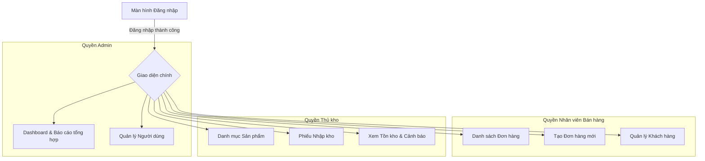

# Thiết kế Frontend (Frontend Design)

Tài liệu này đặc tả thiết kế kiến trúc, cấu trúc thư mục, quản lý state và điều hướng (routing) của ứng dụng Frontend **VueJS 3 + Vuetify 3**.

---

## 1. Cấu trúc Sitemap & Phân quyền Giao diện

Ứng dụng Frontend được thiết kế theo mô hình **Single Page Application (SPA)**, giao diện thay đổi linh hoạt tùy theo vai trò (Role) của người dùng sau khi đăng nhập thành công.



---

## 2. Cấu trúc Mã nguồn (Project Structure)

Thư mục dự án `/Frontend` được thiết kế khoa học, chia tách rõ ràng giữa views, components, stores và services:

```text
/Frontend
├── /public
└── /src
    ├── /assets          # Hình ảnh, global CSS
    ├── /components      # Các components tái sử dụng chung (Button, Card, Dialog...)
    ├── /layouts         # Các layout chính (AuthLayout, MainLayout)
    ├── /router          # Cấu hình điều hướng Vue Router
    ├── /services        # Lớp gọi API (Axios instance, interceptors)
    │   ├── auth.service.js
    │   ├── product.service.js
    │   ├── order.service.js
    │   └── user.service.js
    ├── /stores          # Quản lý state tập trung (Pinia)
    │   ├── auth.store.js
    │   ├── product.store.js
    │   ├── order.store.js
    │   └── ui.store.js
    ├── /views           # Các màn hình chính (Pages)
    │   ├── /auth
    │   ├── /dashboard
    │   ├── /products
    │   ├── /orders
    │   └── /users
    ├── App.vue          # Root Component
    └── main.js          # Khởi chạy ứng dụng
```

---

## 3. Quản lý Điều hướng (Vue Router & Route Guards)

Hệ thống sử dụng **Vue Router 4** để điều hướng trang và áp dụng **Route Guards** để kiểm tra quyền truy cập trước khi render component:

```javascript
import { createRouter, createWebHistory } from 'vue-router';
import { useAuthStore } from '@/stores/auth.store';

const routes = [
  {
    path: '/login',
    component: () => import('@/views/auth/LoginView.vue'),
    meta: { requiresAuth: false }
  },
  {
    path: '/',
    component: () => import('@/layouts/MainLayout.vue'),
    meta: { requiresAuth: true },
    children: [
      {
        path: '',
        redirect: 'dashboard'
      },
      {
        path: 'dashboard',
        component: () => import('@/views/dashboard/DashboardView.vue'),
        meta: { roles: ['Admin'] }
      },
      {
        path: 'products',
        component: () => import('@/views/products/ProductListView.vue'),
        meta: { roles: ['Admin', 'Warehouse'] }
      },
      {
        path: 'orders',
        component: () => import('@/views/orders/OrderListView.vue'),
        meta: { roles: ['Admin', 'Sales'] }
      },
      {
        path: 'orders/create',
        component: () => import('@/views/orders/CreateOrderView.vue'),
        meta: { roles: ['Admin', 'Sales'] }
      },
      {
        path: 'users',
        component: () => import('@/views/users/UserListView.vue'),
        meta: { roles: ['Admin'] }
      }
    ]
  },
  {
    path: '/:pathMatch(.*)*',
    component: () => import('@/views/errors/NotFoundView.vue')
  }
];

export const router = createRouter({
  history: createWebHistory(),
  routes
});

// Route Guard bảo vệ tài nguyên
router.beforeEach(async (to, from, next) => {
  const authStore = useAuthStore();
  const loggedIn = !!authStore.token;

  // 1. Kiểm tra yêu cầu đăng nhập
  if (to.matched.some(record => record.meta.requiresAuth)) {
    if (!loggedIn) {
      return next('/login');
    }

    // 2. Kiểm tra phân quyền vai trò (Role)
    const requiredRoles = to.meta.roles;
    if (requiredRoles && !requiredRoles.includes(authStore.user?.role)) {
      // Không có quyền truy cập, chuyển hướng về trang không có quyền hoặc trang chính
      return next('/unauthorized');
    }
  }

  next();
});
```

---

## 4. Quản lý State tập trung (Pinia Stores)

Ứng dụng sử dụng **Pinia** để quản lý trạng thái chia sẻ giữa các views và components:

### 4.1 Auth Store (`auth.store.js`)
Lưu trữ thông tin đăng nhập của người dùng và các token:
- **State:** `user`, `token`, `refreshToken`, `loading`
- **Getters:** `isAuthenticated`, `userRole`
- **Actions:**
  - `login(username, password)`: Gọi API đăng nhập, lưu JWT vào LocalStorage.
  - `logout()`: Revoke token và chuyển hướng về trang đăng nhập.
  - `refreshAccessToken()`: Gọi API refresh token khi access token hết hạn.

### 4.2 Product Store (`product.store.js`)
Lưu danh sách sản phẩm, bộ lọc tìm kiếm và trạng thái load sản phẩm để tăng tốc độ hiển thị:
- **State:** `products`, `categories`, `units`, `loading`, `totalCount`
- **Actions:**
  - `fetchProducts(filters)`
  - `fetchCategoriesTree()`
  - `createProduct(productData)`

### 4.3 Order Store (`order.store.js`)
Quản lý giỏ hàng tạm thời và danh sách đơn hàng:
- **State:** `orders`, `currentCart`, `loading`
- **Actions:**
  - `addToCart(product, quantity)`
  - `checkoutCart()`
  - `fetchOrderDetails(orderId)`

---

## 5. Cơ chế Gọi API & Interceptor

Tất cả các API được gọi qua một Axios Instance chung cấu hình trong `/src/services/api.js` để tự động đính kèm JWT Token và xử lý mã lỗi tập trung:

```javascript
import axios from 'axios';
import { useAuthStore } from '@/stores/auth.store';
import { router } from '@/router';

const api = axios.create({
  baseURL: 'http://localhost:5000', // Cổng API Gateway
  timeout: 10000,
  headers: {
    'Content-Type': 'application/json'
  }
});

// Request Interceptor: Tự động đính kèm token vào header
api.interceptors.request.use(
  (config) => {
    const authStore = useAuthStore();
    if (authStore.token) {
      config.headers.Authorization = `Bearer ${authStore.token}`;
    }
    return config;
  },
  (error) => Promise.reject(error)
);

// Response Interceptor: Xử lý lỗi tập trung và Refresh Token tự động
api.interceptors.response.use(
  (response) => response.data,
  async (error) => {
    const originalRequest = error.config;
    const authStore = useAuthStore();

    // 1. Xử lý lỗi 401 Unauthorized (Access Token hết hạn)
    if (error.response?.status === 401 && !originalRequest._retry) {
      originalRequest._retry = true;
      try {
        // Gọi API refresh token
        await authStore.refreshAccessToken();
        
        // Thử lại request gốc với token mới
        originalRequest.headers.Authorization = `Bearer ${authStore.token}`;
        return api(originalRequest);
      } catch (refreshError) {
        // Refresh token cũng hết hạn -> Đăng xuất người dùng ngay
        authStore.logout();
        router.push('/login');
        return Promise.reject(refreshError);
      }
    }

    // 2. Xử lý lỗi 403 Forbidden
    if (error.response?.status === 403) {
      router.push('/unauthorized');
    }

    // Trả lỗi về cho component gọi trực tiếp xử lý tiếp (nếu cần hiển thị UI thông báo)
    return Promise.reject(error.response?.data || error.message);
  }
);

export default api;
```
