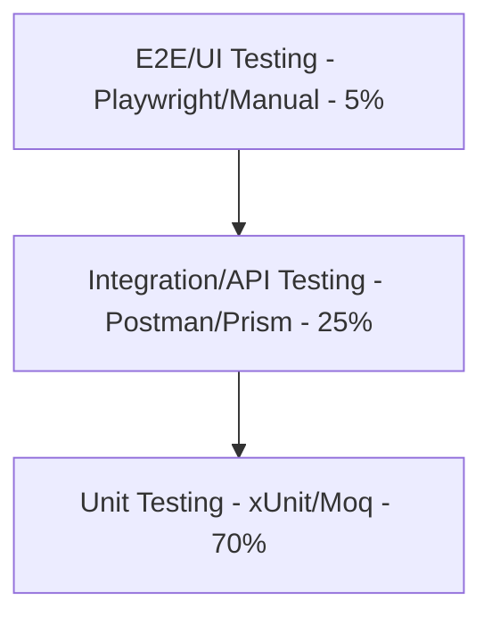

# Chiến lược Kiểm thử (Testing Strategy)

Tài liệu này định nghĩa phương pháp, công cụ và quy chuẩn kiểm thử chất lượng phần mềm trên toàn hệ thống Microservices, đảm bảo mã nguồn hoạt động chính xác trước khi tích hợp.

---

## 1. Phân cấp Kiểm thử trong Hệ thống

Hệ thống áp dụng mô hình kim tự tháp kiểm thử (Testing Pyramid) tập trung nhiều vào kiểm thử đơn vị và kiểm thử tích hợp:



---

## 2. Kiểm thử Đơn vị (Unit Testing với xUnit & Moq)

Unit Test tập trung kiểm thử logic nghiệp vụ độc lập của tầng Domain và Service mà không kết nối cơ sở dữ liệu hoặc dịch vụ mạng thật.

### 2.1 Quy chuẩn đặt tên dự án và file test
- **Tên dự án test:** `<ServiceName>.UnitTests` (Đặt trong thư mục gốc của service đó).
- **Quy tắc đặt tên hàm test:** `TenHam_KichBan_KetQuaMongMuon`
  - VD: `CreateOrder_WithInvalidProduct_ThrowsInvalidOperationException`

### 2.2 Công cụ sử dụng
- **xUnit:** Khung chạy test chính.
- **Moq:** Thư viện giả lập các dependency (ví dụ giả lập DbContext, Repository, RabbitMQ publisher).
- **FluentAssertions:** Thư viện hỗ trợ viết các câu assert tự nhiên, dễ đọc.

### 2.3 Ví dụ viết một Unit Test chuẩn:
```csharp
public class OrderSalesServiceTests
{
    private readonly Mock<IProductRepository> _productRepoMock;
    private readonly Mock<IOrderRepository> _orderRepoMock;
    private readonly OrderSalesService _orderService;

    public OrderSalesServiceTests()
    {
        _productRepoMock = new Mock<IProductRepository>();
        _orderRepoMock = new Mock<IOrderRepository>();
        _orderService = new OrderSalesService(_productRepoMock.Object, _orderRepoMock.Object);
    }

    [Fact]
    public async Task CreateOrder_WithOutOfStockProduct_ShouldThrowException()
    {
        // Arrange (Chuẩn bị dữ liệu và hành vi giả lập)
        var productId = Guid.NewGuid();
        var orderDto = new CreateOrderDto 
        { 
            Items = new List<OrderItemDto> { new OrderItemDto { ProductId = productId, Quantity = 5 } } 
        };

        _productRepoMock.Setup(repo => repo.GetByIdAsync(productId))
            .ReturnsAsync(new Product { Id = productId, QuantityOnHand = 2 }); // Tồn kho chỉ còn 2, yêu cầu 5

        // Act & Assert (Thực thi hành động và kiểm tra kết quả)
        var act = async () => await _orderService.CreateOrderAsync(orderDto);
        
        await act.Should().ThrowAsync<InvalidOperationException>()
            .WithMessage("Sản phẩm Dell XPS đã hết hàng hoặc không đủ tồn kho.");
    }
}
```

---

## 3. Kiểm thử Tích hợp (Integration Testing)

Integration Test tập trung kiểm thử sự phối hợp giữa mã nguồn service với các tài nguyên thật như Cơ sở dữ liệu và API nội bộ chéo service.

### 3.1 Sử dụng Cơ sở dữ liệu cho Test
- Không sử dụng SQLite In-Memory khi test SQL Server vì có sự khác biệt về cú pháp SQL và các hàm built-in.
- **Giải pháp:** Sử dụng thư viện **Respawn** kết hợp với một database SQL Server test riêng chạy bằng Docker để tự động xóa sạch dữ liệu bảng (Clean State) sau mỗi ca test.

### 3.2 Ví dụ cấu hình tích hợp Database:
```csharp
public class ProductIntegrationTests : IAsyncLifetime
{
    private readonly CustomWebApplicationFactory _factory;
    private readonly HttpClient _client;
    private static Checkpoint _checkpoint = new Checkpoint { TablesToIgnore = new[] { "__EFMigrationsHistory" } };

    public ProductIntegrationTests()
    {
        _factory = new CustomWebApplicationFactory();
        _client = _factory.CreateClient();
    }

    public async Task InitializeAsync()
    {
        // Reset dữ liệu DB về trạng thái sạch trước khi chạy test mới
        await _checkpoint.Reset(_factory.ConnectionString);
    }

    public Task DisposeAsync() => Task.CompletedTask;

    [Fact]
    public async Task PostProduct_ValidData_ReturnsCreated()
    {
        // Act
        var response = await _client.PostAsJsonAsync("/api/products", new CreateProductDto { Name = "New Laptop", Code = "SKU100" });

        // Assert
        response.StatusCode.Should().Be(HttpStatusCode.Created);
    }
}
```

---

## 4. Kiểm thử Luồng Xử lý Sự kiện (Event-Driven / Integration Testing)

Để kiểm tra các sự kiện bất đồng bộ qua RabbitMQ (ví dụ: tạo đơn hàng xong thì tồn kho bên Product & Inventory Service tự động trừ):

1. **Ý tưởng:**
   - Client gọi API `POST /api/orders` tạo đơn hàng.
   - Test runner kiểm tra trạng thái HTTP trả về thành công `201 Created`.
   - Chờ tối đa **5 giây** (để RabbitMQ truyền tải message và Product & Inventory Service xử lý xong).
   - Gọi trực tiếp vào CSDL ProductInventoryDB hoặc gọi API `GET /api/products/{id}` kiểm tra xem tồn kho (`QuantityOnHand`) của sản phẩm đã bị trừ chính xác chưa.

---

## 5. Kiểm thử API tự động (Postman Collection & CLI)

Toàn bộ API được tài liệu hóa thành một bộ sưu tập **Postman Collection** chung:
- **Cấu trúc:** Phân chia theo 3 thư mục tương ứng với 3 service.
- **Biến môi trường (Environment Variables):**
  - `baseUrl`: `http://localhost:5000` (API Gateway)
  - `jwtToken`: Tự động gán bằng script sau khi gọi API login thành công.
- **Tự động hóa:** Sử dụng thư viện **Newman** để chạy toàn bộ Postman test suite trực tiếp qua command line trong quy trình CI/CD:
  ```bash
  newman run retail_api_collection.json -e development_env.json
  ```
