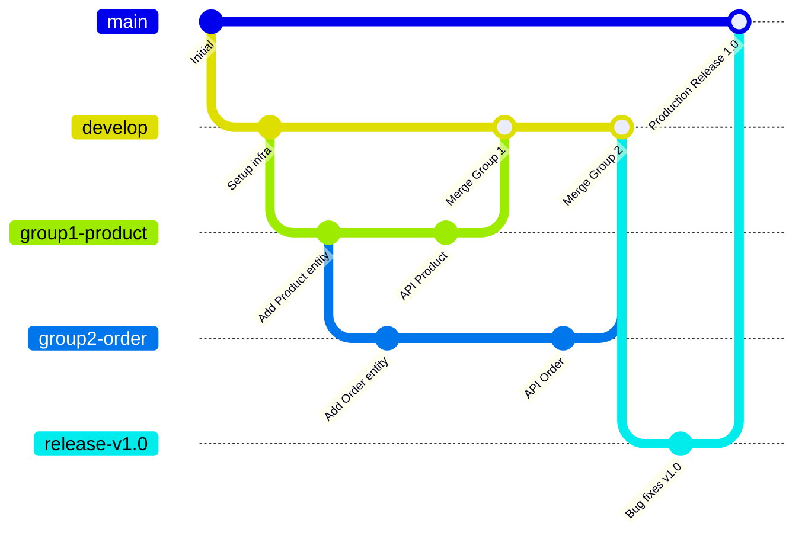

# Quy trình Phát triển (Development Workflow)

Tài liệu này định nghĩa quy trình phối hợp làm việc, chiến lược phân nhánh Git, tiêu chuẩn viết mã nguồn (.NET Coding Standards) và cấu trúc dự án mẫu áp dụng thống nhất cho 3 nhóm phát triển độc lập.

---

## 1. Chiến lược Git Branching (GitFlow phối hợp 3 nhóm)

Dự án sử dụng chung một kho chứa mã nguồn (Mono-repo) được chia thành các thư mục độc lập cho mỗi Service. Để phối hợp trơn tru và tránh xung đột mã nguồn, hệ thống áp dụng mô hình **GitFlow**:



### 1.1 Quy tắc đặt tên Branch
- Nhánh chính thức: `main` (chạy trên môi trường Production).
- Nhánh phát triển chung: `develop` (nhánh gom code của cả 3 nhóm).
- Nhánh của các nhóm phát triển tính năng riêng:
  - Nhóm 1 (Product & Inventory): `group1-product/*`
  - Nhóm 2 (Order & Sales): `group2-order/*`
  - Nhóm 3 (User & Report): `group3-user/*`

### 1.2 Quy trình tạo Pull Request (PR)
1. Trước khi viết code tính năng mới, đồng bộ hóa nhánh develop của local với remote: `git pull origin develop`.
2. Tạo nhánh tính năng từ develop: `git checkout -b group1-product/add-category-crud`.
3. Hoàn thành code, chạy Unit Test kiểm tra đạt 100% thành công.
4. Push code lên remote và tạo Pull Request (PR) vào nhánh `develop`.
5. Yêu cầu ít nhất **1 thành viên thuộc nhóm khác** review code trước khi merge.

---

## 2. Chuẩn viết mã nguồn (.NET Coding Standards)

Toàn bộ dự án tuân thủ hướng dẫn viết mã nguồn C# chuẩn của Microsoft:

### 2.1 Quy tắc đặt tên (Naming Conventions)
- **PascalCase:** Dành cho tên Lớp (`ProductController`), tên Interface (`IProductRepository`), tên Hàm (`CreateProduct`), tên Thuộc tính (`Price`).
- **camelCase:** Dành cho tên biến cục bộ (`productId`), tham số đầu vào (`quantity`).
- **camelCase kèm dấu gạch dưới `_`:** Dành cho các trường nội bộ private/protected (`_productRepository`).
- **UPPER_CASE:** Dành cho các hằng số (`MAX_QUANTITY_LIMIT`).

### 2.2 Quy tắc viết code sạch (Clean Code)
- Mọi Interface phải bắt đầu bằng chữ `I` (VD: `IOrderSalesService`).
- Dùng `async/await` xuyên suốt tất cả các tác vụ truy xuất cơ sở dữ liệu và gọi API chéo.
- Áp dụng triệt để nguyên lý **Single Responsibility Principle (SRP)**: Mỗi lớp, mỗi hàm chỉ nên làm duy nhất một nhiệm vụ.
- Tránh viết các hàm quá dài (tối đa 50 dòng code cho một hàm nghiệp vụ).

---

## 3. Cấu trúc Mã nguồn một Service Chuẩn (DDD & Clean Architecture)

Mỗi Microservice C# được tổ chức theo cấu trúc 3 lớp (3-Tier Layered Architecture) chuẩn để dễ dàng bảo trì và viết Unit Test:

```text
/ProductInventoryService
├── /ProductInventoryService.API             # Tầng trình diễn (Presentation Layer)
│   ├── /Controllers                # API Controllers nhận HTTP Request
│   ├── Program.cs                  # Điểm khởi chạy ứng dụng, cấu hình DI
│   └── appsettings.json            # File cấu hình môi trường
│
├── /ProductInventoryService.Application     # Tầng nghiệp vụ (Application Layer)
│   ├── /DTOs                       # Data Transfer Objects (Request/Response)
│   ├── /Services                   # Lớp Service chứa logic nghiệp vụ chính
│   └── /Interfaces                 # Định nghĩa các Interface nghiệp vụ
│
└── /ProductInventoryService.Infrastructure  # Tầng hạ tầng (Infrastructure Layer)
    ├── /Data                       # Entity Framework DbContext
    ├── /Entities                   # Domain Models (Database Entities)
    ├── /Repositories               # Lớp triển khai Repository truy vấn DB
    └── /Messaging                  # RabbitMQ Message Consumers & Publishers
```

---

## 4. Dữ liệu mẫu khởi tạo (Seed Data & Test Accounts)

Khi hệ thống khởi chạy bằng lệnh `docker-compose up -d --build`, hệ thống sẽ tự động chạy EF Core Migrations và chèn dữ liệu mẫu vào 3 database:

### 4.1 Tài khoản thử nghiệm mặc định (UserReportDB):

| Tài khoản (Username) | Mật khẩu (Password) | Vai trò (Role) | Mục đích thử nghiệm |
|---|---|---|---|
| `admin` | `SuperStrong@Password123` | **Admin** | Quản trị toàn hệ thống, xem dashboard báo cáo tổng hợp |
| `sales01` | `SuperStrong@Password123` | **Sales** | Tạo đơn hàng mới, quản lý khách hàng |
| `warehouse01` | `SuperStrong@Password123` | **Warehouse** | Quản lý sản phẩm, tạo phiếu nhập kho |

### 4.2 Nhóm khách hàng mặc định (OrderSalesDB):
- **Khách VIP (`group-vip-id`):** Chiết khấu mặc định 10.0%.
- **Khách Lẻ (`group-retail-id`):** Chiết khấu mặc định 0.0%.
- **Khách Sỉ (`group-wholesale-id`):** Chiết khấu mặc định 15.0%.
