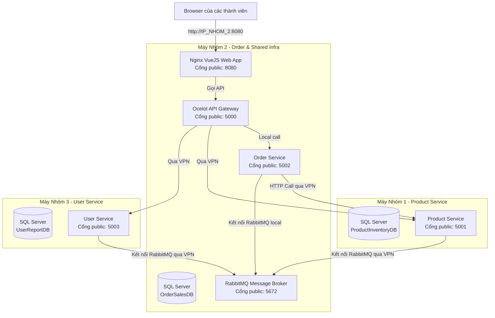

# Hướng dẫn Triển khai Liên nhóm qua Radmin VPN (Multi-Group Deployment Guide)

Tài liệu này hướng dẫn chi tiết cách cấu hình, triển khai và liên kết hệ thống microservices giữa **3 nhóm** làm việc từ xa bằng cách sử dụng mạng riêng ảo **Radmin VPN** và **Docker Compose**.

---

## 1. Kiến trúc phân bổ hệ thống (System Topology)

Trong mô hình này, mỗi nhóm tự chạy Database của riêng mình để tự chủ dữ liệu phát triển. Các dịch vụ chung (Gateway, Frontend, RabbitMQ) sẽ được chạy tập trung trên máy của **Nhóm 2 (Order Service)**.



---

## 2. Bước 1: Thiết lập mạng ảo Radmin VPN

Tất cả các thành viên trong các nhóm cần tải và cài đặt [Radmin VPN](https://www.radmin-vpn.com/) (miễn phí).

1.  **Tạo mạng chung (Thực hiện bởi trưởng nhóm hoặc Nhóm 2):**
    *   Mở Radmin VPN -> Chọn **Network** -> **Create New Network**.
    *   Đặt tên mạng (ví dụ: `Retail-Microservices-BTL`) và mật khẩu.
2.  **Tham gia mạng (Thực hiện bởi các thành viên khác):**
    *   Chọn **Network** -> **Join an Existing Network**.
    *   Nhập tên mạng và mật khẩu vừa tạo.
3.  **Lấy và ghi nhận địa chỉ IP Radmin VPN:**
    *   Mỗi máy sau khi kết nối sẽ hiển thị một IP dạng `26.x.x.x` bên cạnh tên máy trong Radmin VPN.
    *   Ghi lại IP này của 3 nhóm (đại diện cho máy chạy Backend của mỗi nhóm). Ví dụ giả định:
        *   **IP Nhóm 1 (Product):** `26.11.11.11`
        *   **IP Nhóm 2 (Order - máy chủ chứa infra):** `26.22.22.22`
        *   **IP Nhóm 3 (User):** `26.33.33.33`

---

## 3. Bước 2: Triển khai cho Máy Nhóm 2 (Order & Shared Infra)

Nhóm 2 chạy các dịch vụ cốt lõi và hạ tầng dùng chung. 

### 3.1. Cấu hình tệp môi trường `.env.group2`
Tại thư mục gốc dự án, tạo file `.env.group2` và cấu hình các IP Radmin VPN thực tế thu được:

```ini
# IP Radmin VPN của 3 máy chạy backend
RADMIN_IP_NHOM1=26.11.11.11
RADMIN_IP_NHOM2=26.22.22.22
RADMIN_IP_NHOM3=26.33.33.33

# Mật khẩu sa SQL Server của Nhóm 2
MSSQL_SA_PASSWORD=SuperStrong@Password123
MSSQL_PID=Developer

# RabbitMQ credentials
RABBITMQ_DEFAULT_USER=guest
RABBITMQ_DEFAULT_PASS=guest

# Bảo mật token JWT
JWT_SECRET=this-is-a-very-long-and-super-secure-secret-key-32-bytes-long!
JWT_ISSUER=RetailSystemApi
JWT_AUDIENCE=RetailSystemClient
```

### 3.2. Khởi chạy hệ thống bằng Docker Compose
Nhóm 2 chạy lệnh dưới đây để khởi động cơ sở dữ liệu local, RabbitMQ, Gateway, Frontend và Order Service:

```bash
docker compose --env-file .env.group2 -f docker-compose.group2.yml up -d --build
```

---

## 4. Bước 3: Triển khai cho Máy Nhóm 1 (Product & Inventory Service)

Nhóm 1 chỉ chạy SQL Server chứa dữ liệu Product và chạy service Product.

### 4.1. Cấu hình tệp môi trường `.env.group1`
Tại thư mục gốc dự án trên máy Nhóm 1, tạo file `.env.group1`:

```ini
# Trỏ đến IP Radmin VPN của Nhóm 2 (nơi chạy RabbitMQ)
RADMIN_IP_NHOM2=26.22.22.22

# Cấu hình SQL Server của Nhóm 1
MSSQL_SA_PASSWORD=SuperStrong@Password123
MSSQL_PID=Developer

# Đồng nhất tài khoản RabbitMQ với Nhóm 2
RABBITMQ_DEFAULT_USER=guest
RABBITMQ_DEFAULT_PASS=guest

# Đồng nhất JWT key
JWT_SECRET=this-is-a-very-long-and-super-secure-secret-key-32-bytes-long!
JWT_ISSUER=RetailSystemApi
JWT_AUDIENCE=RetailSystemClient
```

### 4.2. Tạo tệp `docker-compose.group1.yml`
Tạo tệp này tại thư mục gốc máy Nhóm 1 để chạy các service của nhóm:

```yaml
services:
  sqlserver:
    image: mcr.microsoft.com/mssql/server:2022-latest
    container_name: retail_sqlserver_nhom1
    environment:
      ACCEPT_EULA: "Y"
      MSSQL_SA_PASSWORD: ${MSSQL_SA_PASSWORD:-SuperStrong@Password123}
    ports:
      - "1433:1433"
    volumes:
      - sqlserver_data_nhom1:/var/opt/mssql
    networks:
      - retail_network_nhom1
    healthcheck:
      test: ["CMD-SHELL", "/opt/mssql-tools18/bin/sqlcmd -C -S localhost -U sa -P \"$$MSSQL_SA_PASSWORD\" -Q \"SELECT 1\" || /opt/mssql-tools/bin/sqlcmd -S localhost -U sa -P \"$$MSSQL_SA_PASSWORD\" -Q \"SELECT 1\""]
      interval: 10s
      timeout: 5s
      retries: 10
      start_period: 30s
    restart: always

  product-inventory-service:
    build:
      context: ./src
      dockerfile: ProductInventoryService/ProductInventoryService.API/Dockerfile
    container_name: retail_product_inventory_service_nhom1
    environment:
      ASPNETCORE_ENVIRONMENT: Development
      ASPNETCORE_URLS: http://+:80
      ConnectionStrings__DefaultConnection: Server=sqlserver;Database=ProductInventoryDB;User Id=sa;Password=${MSSQL_SA_PASSWORD:-SuperStrong@Password123};TrustServerCertificate=True;
      RabbitMQ__HostName: ${RADMIN_IP_NHOM2}
      RabbitMQ__UserName: ${RABBITMQ_DEFAULT_USER:-guest}
      RabbitMQ__Password: ${RABBITMQ_DEFAULT_PASS:-guest}
      JwtSettings__Secret: ${JWT_SECRET:-this-is-a-very-long-and-super-secure-secret-key-32-bytes-long!}
      JwtSettings__Issuer: ${JWT_ISSUER:-RetailSystemApi}
      JwtSettings__Audience: ${JWT_AUDIENCE:-RetailSystemClient}
    depends_on:
      sqlserver:
        condition: service_healthy
    ports:
      - "5001:80"
    networks:
      - retail_network_nhom1
    restart: always

networks:
  retail_network_nhom1:
    name: retail_network_nhom1
    driver: bridge

volumes:
  sqlserver_data_nhom1:
```

### 4.3. Khởi chạy
Chạy lệnh khởi chạy trên máy Nhóm 1:
```bash
docker compose --env-file .env.group1 -f docker-compose.group1.yml up -d --build
```

---

## 5. Bước 4: Triển khai cho Máy Nhóm 3 (User & Report Service)

Nhóm 3 chỉ chạy SQL Server chứa dữ liệu User/Report và chạy service User Report.

### 5.1. Cấu hình tệp môi trường `.env.group3`
Tại thư mục gốc dự án trên máy Nhóm 3, tạo file `.env.group3`:

```ini
# Trỏ đến IP Radmin VPN của Nhóm 2 (nơi chạy RabbitMQ)
RADMIN_IP_NHOM2=26.22.22.22

# Cấu hình SQL Server của Nhóm 3
MSSQL_SA_PASSWORD=SuperStrong@Password123
MSSQL_PID=Developer

# Đồng nhất tài khoản RabbitMQ với Nhóm 2
RABBITMQ_DEFAULT_USER=guest
RABBITMQ_DEFAULT_PASS=guest

# Đồng nhất JWT key
JWT_SECRET=this-is-a-very-long-and-super-secure-secret-key-32-bytes-long!
JWT_ISSUER=RetailSystemApi
JWT_AUDIENCE=RetailSystemClient
```

### 5.2. Tạo tệp `docker-compose.group3.yml`
Tạo tệp này tại thư mục gốc máy Nhóm 3 để chạy các service của nhóm:

```yaml
services:
  sqlserver:
    image: mcr.microsoft.com/mssql/server:2022-latest
    container_name: retail_sqlserver_nhom3
    environment:
      ACCEPT_EULA: "Y"
      MSSQL_SA_PASSWORD: ${MSSQL_SA_PASSWORD:-SuperStrong@Password123}
    ports:
      - "1433:1433"
    volumes:
      - sqlserver_data_nhom3:/var/opt/mssql
    networks:
      - retail_network_nhom3
    healthcheck:
      test: ["CMD-SHELL", "/opt/mssql-tools18/bin/sqlcmd -C -S localhost -U sa -P \"$$MSSQL_SA_PASSWORD\" -Q \"SELECT 1\" || /opt/mssql-tools/bin/sqlcmd -S localhost -U sa -P \"$$MSSQL_SA_PASSWORD\" -Q \"SELECT 1\""]
      interval: 10s
      timeout: 5s
      retries: 10
      start_period: 30s
    restart: always

  user-report-service:
    build:
      context: ./src
      dockerfile: UserReportService/UserReportService.API/Dockerfile
    container_name: retail_user_report_service_nhom3
    environment:
      ASPNETCORE_ENVIRONMENT: Development
      ASPNETCORE_URLS: http://+:80
      ConnectionStrings__DefaultConnection: Server=sqlserver;Database=UserReportDB;User Id=sa;Password=${MSSQL_SA_PASSWORD:-SuperStrong@Password123};TrustServerCertificate=True;
      RabbitMQ__HostName: ${RADMIN_IP_NHOM2}
      RabbitMQ__UserName: ${RABBITMQ_DEFAULT_USER:-guest}
      RabbitMQ__Password: ${RABBITMQ_DEFAULT_PASS:-guest}
      JwtSettings__Secret: ${JWT_SECRET:-this-is-a-very-long-and-super-secure-secret-key-32-bytes-long!}
      JwtSettings__Issuer: ${JWT_ISSUER:-RetailSystemApi}
      JwtSettings__Audience: ${JWT_AUDIENCE:-RetailSystemClient}
    depends_on:
      sqlserver:
        condition: service_healthy
    ports:
      - "5003:80"
    networks:
      - retail_network_nhom3
    restart: always

networks:
  retail_network_nhom3:
    name: retail_network_nhom3
    driver: bridge

volumes:
  sqlserver_data_nhom3:
```

### 5.3. Khởi chạy
Chạy lệnh khởi chạy trên máy Nhóm 3:
```bash
docker compose --env-file .env.group3 -f docker-compose.group3.yml up -d --build
```

---

## 6. Thứ tự khởi chạy khuyên dùng

Để tránh trường hợp các Backend service bị ngắt kết nối hoặc crash do không tìm thấy hạ tầng RabbitMQ chung, vui lòng khởi chạy theo đúng thứ tự sau:

1.  **Nhóm 2** bắt đầu bật Radmin VPN.
2.  **Nhóm 1 & 3** bật Radmin VPN và đảm bảo ping thông suốt tới máy Nhóm 2:
    ```bash
    ping 26.22.22.22
    ```
3.  **Nhóm 2** khởi động hệ thống để dựng cổng kết nối RabbitMQ và Gateway trước:
    ```bash
    docker compose --env-file .env.group2 -f docker-compose.group2.yml up -d
    ```
4.  Sau khi RabbitMQ của Nhóm 2 đã chạy ổn định (`retail_rabbitmq_nhom2` có trạng thái `healthy`), **Nhóm 1** và **Nhóm 3** bắt đầu khởi chạy Docker Compose của nhóm mình:
    *   **Nhóm 1:** `docker compose --env-file .env.group1 -f docker-compose.group1.yml up -d --build`
    *   **Nhóm 3:** `docker compose --env-file .env.group3 -f docker-compose.group3.yml up -d --build`
5.  Mở trình duyệt truy cập `http://26.22.22.22:8080` (hoặc `localhost:8080` trên máy Nhóm 2) để sử dụng ứng dụng web.

---

## 7. Khắc phục sự cố & Gỡ lỗi (Troubleshooting)

### 7.1. Lỗi Firewall Windows chặn kết nối
Nếu các nhóm đã kết nối vào Radmin VPN và ping thành công nhưng không thể truy cập các API của nhau hoặc không kết nối được RabbitMQ:
*   **Nguyên nhân:** Tường lửa của Windows (Windows Defender Firewall) mặc định chặn các request đi vào qua mạng ảo của Radmin VPN.
*   **Cách khắc phục (Thực hiện trên tất cả các máy):**
    1.  Mở **Windows Defender Firewall** -> Chọn **Advanced Settings**.
    2.  Chọn mục **Inbound Rules** -> Nhấp **New Rule...** ở khung bên phải.
    3.  Chọn loại rule là **Port** -> Chọn **TCP** và chỉ định các cổng cần mở (ví dụ: `1433, 5672, 15672, 5000, 5001, 5002, 5003, 8080`) hoặc chọn **All local ports** để mở toàn bộ.
    4.  Chọn **Allow the connection** -> Tick chọn tất cả các mạng (Domain, Private, Public) -> Đặt tên rule là `Radmin VPN Allow Ports` và lưu lại.

### 7.2. Lỗi CORS (Cross-Origin Resource Sharing) tại Gateway
Nếu trình duyệt của Nhóm 1 hoặc Nhóm 3 truy cập được giao diện Frontend nhưng khi đăng nhập báo lỗi CORS đỏ lòm ở Console F12:
*   **Nguyên nhân:** API Gateway chặn các domain không được cấu hình trong CORS.
*   **Cách khắc phục:** Đảm bảo biến `Cors__AllowedOrigins__4` trong file `docker-compose.group2.yml` của Nhóm 2 trỏ chính xác về `http://<IP_Radmin_Nhom2>:8080`. Khi các thành viên khác truy cập qua IP VPN của bạn, trình duyệt sẽ coi origin là `http://<IP_Radmin_Nhom2>:8080`, việc cấu hình CORS này sẽ cho phép Gateway xử lý yêu cầu.

### 7.3. Cách Reset lại dữ liệu local của từng nhóm
Nếu muốn dọn dẹp và reset lại dữ liệu của cơ sở dữ liệu cụ thể:
*   **Nhóm 1:** `docker compose -f docker-compose.group1.yml down -v`
*   **Nhóm 2:** `docker compose -f docker-compose.group2.yml down -v`
*   **Nhóm 3:** `docker compose -f docker-compose.group3.yml down -v`
