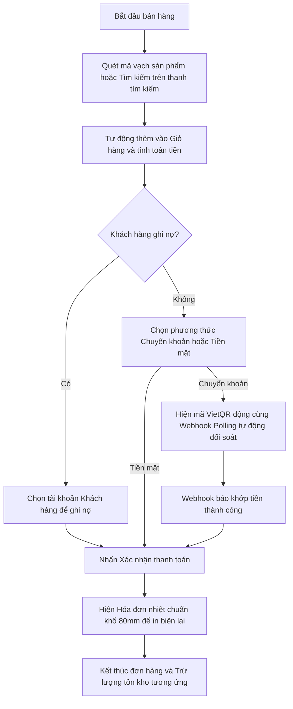
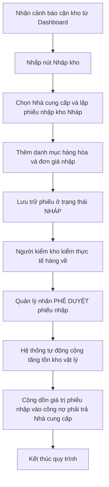

# TÀI LIỆU ĐẶC TẢ CHI TIẾT GIAO DIỆN NGƯỜI DÙNG (UI SPECIFICATION DOCUMENT)
## HỆ THỐNG QUẢN LÝ BÁN LẺ & KHO HÀNG (RETAIL & INVENTORY POS SYSTEM)

---

## 1. TỔNG QUAN GIAO DIỆN HỆ THỐNG

### 1.1. Phong Cách Thiết Kế Chủ Đạo (Design Theme)
Hệ thống được thiết kế theo phong cách **Glassmorphic Cosmic Dark Mode** (Giao diện kính mờ huyền ảo kết hợp chế độ nền tối sâu). 
* **Đặc trưng trực quan:**
  * Toàn bộ hệ thống sử dụng một lớp phủ kính mờ nhẹ (`backdrop-filter: blur(28px)`) trên nền đen vũ trụ sâu thẳm, tạo độ trong suốt tinh tế và cảm giác không gian đa chiều cao cấp.
  * Các đường viền thành phần siêu mỏng (`border: 1px solid rgba(255, 255, 255, 0.08)`) mang lại sự sắc nét, thanh lịch.
  * 3 Quả cầu năng lượng sắc màu lớn (Neon Orbs) trôi nổi tự do dưới nền với hiệu ứng chuyển động chậm chậm (`slow float animation`), tạo chiều sâu thị giác ấn tượng và giảm thiểu cảm giác nhàm chán cho nhân viên thao tác lâu.

### 1.2. Quy Chuẩn Màu Sắc (Color System - HSL Tailored)
Hệ thống sử dụng bảng màu HSL đồng nhất với tỷ lệ tương phản cao giúp tăng khả năng nhận diện thông tin nhanh chóng:

| Nhóm Màu | Tên Màu | Mã Màu HSL / Hex | Ứng Dụng Trong Giao Diện |
| :--- | :--- | :--- | :--- |
| **Primary** | Violet/Indigo | `hsl(270, 85%, 60%)` / `#7c4dff` | Nút bấm thao tác chính (CTA), Icon thương hiệu, nhãn danh mục đang chọn |
| **Secondary**| Cyan Neon | `hsl(180, 100%, 50%)` / `#00e5ff` | Trạng thái đang tương tác (Focus), Tooltip, đường viền phát sáng của ô nhập liệu |
| **Dark BG** | Deep Charcoal | `hsl(225, 30%, 8%)` / `#08090f` | Nền toàn bộ trang web |
| **Panel BG** | Glassy Slate | `rgba(20, 24, 38, 0.72)` | Thẻ hiển thị dữ liệu (Cards), Hóa đơn bán lẻ, Khung nhập liệu |
| **Success** | Emerald Green | `#10b981` | Đơn hàng đã thanh toán, Tồn kho an toàn, Số dư dương |
| **Warning** | Amber Yellow | `#f59e0b` | Đơn hàng nháp, Tồn kho cận kho tối thiểu, Chờ duyệt |
| **Danger** | Crimson Red | `#ef4444` | Đơn hàng đã hủy, Tồn kho đã hết hàng, Nợ quá hạn |

### 1.3. Hệ Thống Typography (Font Chữ)
Tối ưu hóa khả năng đọc dữ liệu số liệu thông qua việc phân chia rõ ràng hai phông chữ:
* **Outfit (Sans-serif):** Dành cho các thành phần tiêu đề (`h1` - `h4`), nhãn thương hiệu, logo và các trị số tiền tệ hiển thị lớn. Mang lại cảm giác tròn trịa, hiện đại và cao cấp.
* **Inter (Sans-serif):** Dành cho toàn bộ văn bản nội dung, nhãn mô tả thông tin, bảng dữ liệu, ô nhập liệu, danh sách và phần phụ đề. Giúp chữ hiển thị sắc nét dù ở kích thước nhỏ.

### 1.4. Quy Chuẩn Thành Phần Cơ Bản
* **Cards (Khung chứa):** Thiết kế bo góc lớn `border-radius: 24px` (`rounded-xl`), có hiệu ứng viền sáng kim loại trên cùng (`sheen effect`) và đổ bóng sâu (`elevation-24`).
* **Buttons (Nút bấm):** Có chiều cao tối thiểu `40px` (riêng nút lớn đăng nhập/thanh toán là `52px`). Bo góc `rounded-xl`, hover có hiệu ứng nâng nhẹ và đổ bóng màu phát sáng.
* **Form Inputs (Ô nhập):** Nền tối mờ, bo tròn góc `8px`, nhãn nổi (floating label). Khi được click (`focus state`), đường viền chuyển xanh Cyan và tỏa ánh sáng nhẹ tỏa ra từ viền.
* **Tables (Bảng biểu):** Các dòng xen kẽ độ sáng nhẹ, dòng được di chuột qua sẽ đổi màu nền, độ cao dòng `48px`, tiêu đề cột viết hoa và in đậm.

---

## 2. CẤU TRÚC LAYOUT CHUNG

Khung sườn giao diện của ứng dụng được xây dựng theo cấu trúc phản hồi dạng cột gọn gàng và khoa học:

### 2.1. Header (Thanh Điều Hướng Trên)
* **Vị trí:** Cố định ở góc trên cùng của màn hình (`sticky top`).
* **Thành phần:**
  * **Brand Widget:** Logo hình cầu phát sáng xung mạch và dòng tiêu đề "RETAIL & KHO HÀNG".
  * **Theme Switcher:** Nút icon nhỏ dạng Mặt trời/Mặt trăng để bật tắt giao diện Light/Dark.
  * **Profile Quick-view:** Avatar người dùng hình tròn, kèm Tên hiển thị và Nhãn vai trò (Admin/Sales/Warehouse) có màu sắc tương ứng với mức độ phân quyền.
  * **Logout Button:** Nút màu đỏ dạng icon mờ giúp thoát phiên làm việc nhanh.
* **Hành vi khi thu nhỏ màn hình:** Ẩn tên người dùng và nhãn vai trò, chỉ giữ lại Avatar và nút đăng xuất dạng Icon tối giản.

### 2.2. Sidebar (Thanh Menu Trái)
* **Vị trí:** Cố định ở cạnh trái màn hình Desktop, rộng `256px`.
* **Thành phần:** Danh sách dọc gồm 6 nút chuyển tab kèm biểu tượng cảm xúc/icon trực quan.
* **Hành vi tương tác:**
  * **Trạng thái thường:** Màu xám mờ nhẹ, hòa hợp vào nền tối.
  * **Trạng thái hover:** Nền phím sáng nhẹ lên, icon dịch chuyển nhẹ sang phải `2px`.
  * **Trạng thái active (đang chọn):** Chữ và icon đổi sang màu tím sáng, cạnh trái có một đường kẻ đứng phát sáng màu xanh lá/cyan làm điểm tựa.
* **Hành vi khi responsive:** Trên Tablet, tự động thu nhỏ độ rộng về `80px` và chỉ hiển thị Icon chính giữa. Trên Mobile, ẩn hoàn toàn và chuyển thành ngăn kéo trượt ra từ bên trái (`navigation drawer`) kích hoạt qua nút bấm Hamburger ở Header.

### 2.3. Content Area (Vùng Hiển Thị Nghiệp Vụ)
* **Vị trí:** Chiếm toàn bộ không gian còn lại ở trung tâm.
* **Hành vi:** Tự động giãn nở linh hoạt theo kích thước khung nhìn trình duyệt. Có đệm lề (`padding: 24px` trên Desktop, giảm xuống `12px` trên Mobile để tăng tối đa diện tích hiển thị dữ liệu).

---

## 3. DANH SÁCH TOÀN BỘ MÀN HÌNH

Hệ thống quản lý bao gồm 8 màn hình chức năng chính:
1. **Màn hình Đăng nhập (Login)**
2. **Màn hình Bảng điều khiển (Dashboard)**
3. **Màn hình Bán hàng (POS)**
4. **Màn hình Quản lý đơn hàng (Orders)**
5. **Màn hình Quản lý kho hàng (Inventory)**
6. **Màn hình Nhập kho (Goods Receipt)**
7. **Màn hình Quản lý công nợ đối tác (Debt)**
8. **Màn hình Lỗi 404 (NotFound)**

---

## 4. MÔ TẢ CHI TIẾT TỪNG MÀN HÌNH

---

### MÀN HÌNH 1: ĐĂNG NHẬP (LOGIN SCREEN)

#### 1. Mục đích màn hình
Màn hình duy nhất xuất hiện khi người dùng chưa đăng nhập hệ thống, dùng để xác thực quyền truy cập và điều hướng người dùng tới phân hệ tương ứng.

#### 2. Layout tổng thể
* Bố cục căn giữa hoàn hảo (`Centered Grid`) cả chiều dọc và chiều ngang.
* Khung đăng nhập nổi trên nền gradient huyền ảo có các quả cầu phát sáng chuyển động chậm phía sau.

#### 3. Thành phần giao diện chi tiết
* **Brand Pulse Logo:** Khung biểu tượng dạng cầu có viền sáng gradient mờ, có hiệu ứng sóng tròn co giãn xung quanh.
* **Username Field:** Ô nhập tài khoản, có icon tài khoản dạng nét mảnh (`mdi-account-circle-outline`) nằm trong khung nhập.
* **Password Field:** Ô nhập mật khẩu, ký tự ẩn, có icon chìa khóa mở (`mdi-lock-open-outline`).
* **Submit Button:** Nút bấm kích thước lớn dải màu gradient từ tím sang xanh cyan. Chữ viết hoa "ĐĂNG NHẬP HỆ THỐNG".

#### 4. Hành vi người dùng (User Interaction)
* **Khi hover nút đăng nhập:** Nút chuyển động nâng lên nhẹ `translateY(-2px)` và tỏa bóng màu tím rực rỡ bên dưới.
* **Khi click Submit:** 
  * Vô hiệu hóa nút và hai ô nhập (Disabled state). Hiển thị vòng xoay tải dữ liệu (Loading spinner) tại nút bấm.
  * Nếu đăng nhập đúng tài khoản: Thực hiện hiệu ứng trượt mờ (`fade-out`) của màn hình đăng nhập và trượt xuất hiện (`fade-in`) của giao diện làm việc chính.

#### 5. Form và Validate
| Tên Trường | Kiểu Dữ Liệu | Bắt Buộc | Quy Tắc Kiểm Định (Validate Rule) |
| :--- | :--- | :--- | :--- |
| **Tên tài khoản** | Text | Có | Không để trống, tối thiểu 3 ký tự, không chứa ký tự đặc biệt |
| **Mật khẩu** | Password | Có | Không để trống, tối thiểu 6 ký tự |

#### 6. Trạng thái giao diện
* **Loading State:** Nút đăng nhập hiển thị vòng quay tròn mờ, vô hiệu hóa việc nhấp chuột và sửa đổi dữ liệu form.
* **Error State:** Ô nhập có viền chuyển màu đỏ rực, hiển thị dòng text báo lỗi nhỏ màu đỏ bên dưới: "Tài khoản hoặc mật khẩu không chính xác".

#### 7. Responsive Design
* **Desktop & Tablet:** Thẻ đăng nhập cố định chiều rộng `460px` ở trung tâm.
* **Mobile:** Thẻ đăng nhập tự co giãn chiếm 100% chiều rộng màn hình, padding biên co lại thành `16px` để tránh bị chật chội.

#### 8. Điều hướng
* Đăng nhập thành công -> Tự động chuyển tab sang màn hình Dashboard.

---

### MÀN HÌNH 2: BẢNG ĐIỀU KHIỂN TRUNG TÂM (DASHBOARD)

#### 1. Mục đích màn hình
Hiển thị tổng quan các báo cáo tài chính nhanh, hiệu suất kinh doanh trong ngày, biểu đồ doanh thu trực quan và các cảnh báo khẩn cấp về tồn kho hàng hóa.

#### 2. Layout tổng thể
* **Hàng đầu:** Tiêu đề trang "Bảng Điều Khiển Hệ Thống" ở bên trái và nút tác vụ nhanh "Làm mới" ở bên phải.
* **Hàng thứ hai:** Bộ 4 thẻ KPI tóm tắt trải dài theo dạng lưới phản hồi.
* **Hàng thứ ba:** Chia làm 2 cột chính: Cột trái (7/12 chiều rộng) hiển thị biểu đồ cột doanh số; Cột phải (5/12 chiều rộng) hiển thị danh sách sản phẩm cạn kho.

#### 3. Thành phần giao diện chi tiết
* **KPI Card (Thẻ chỉ số nhanh):** 
  * Gồm 4 thẻ: Tổng doanh thu, Số đơn hàng, Tổng tồn kho vật lý, Công nợ đối tác.
  * Mỗi thẻ có một Avatar hình tròn màu neon độc lập tương ứng với màu sắc ý nghĩa chỉ số kèm theo trị số lớn đậm và dòng chỉ báo phần trăm tăng trưởng nhỏ (Xanh là tăng, Đỏ là giảm).
* **Revenue Bar Chart (Biểu đồ doanh thu):**
  * Biểu đồ dựng bằng hình họa SVG tinh tế gồm các cột dọc thể hiện doanh thu theo các khung giờ phát sinh trong ngày.
  * Mỗi cột có hiệu ứng dải màu gradient dọc vuốt từ Tím sang Xanh Cyan.
  * Có tooltip dạng bong bóng kính mờ đen hiển thị chính xác số tiền VNĐ khi di chuột qua cột.
* **Low Stock Alerts Panel (Cột cảnh báo kho):**
  * Danh sách dạng các thanh màu viền đỏ mờ chứa thông tin các mặt hàng sắp hết.
  * Mỗi dòng gồm: Tên sản phẩm, SKU, số lượng tồn hiện hành và hạn mức tối thiểu. Kèm nút tác vụ nhanh "Nhập kho" màu tím mờ bên cạnh.

#### 4. Hành vi người dùng (User Interaction)
* **Hover cột biểu đồ:** Cột sáng bừng lên và hiển thị tooltip giá trị chi tiết.
* **Click nút "Nhập kho" trong danh sách cảnh báo:** Màn hình tự động chuyển sang tab "Nhập kho" để người dùng tiếp tục thao tác mua hàng mà không cần bấm thủ công.
* **Click nút "Làm mới":** Kích hoạt hiệu ứng xoay tròn của biểu tượng refresh, dữ liệu biểu đồ và KPI được cập nhật theo hoạt động thực tế.

#### 5. Trạng thái giao diện
* **Empty State (Biểu đồ doanh số):** Nếu hôm nay chưa phát sinh giao dịch bán hàng, biểu đồ ẩn đi và hiển thị dòng chữ mờ: "Chưa có dữ liệu doanh số phát sinh hôm nay. Hãy bắt đầu phiên bán hàng tại POS."

#### 6. Responsive Design
* **Desktop:** Bố cục chia hai cột ngang song song (Biểu đồ & Cảnh báo kho).
* **Tablet:** Biểu đồ chuyển thành dạng toàn màn hình, danh sách cảnh báo kho bị đẩy xuống phía dưới thành một hàng riêng biệt.
* **Mobile:** 4 thẻ KPI xếp dọc chồng lên nhau thành 1 cột. Biểu đồ tự co nhỏ thanh cột để hiển thị gọn gàng trên màn hình nhỏ.

#### 7. Điều hướng
* Có các nút điều hướng nhanh sang tab "POS" hoặc tab "Nhập kho".

---

### MÀN HÌNH 3: BÁN HÀNG TẬP TRUNG (POS - POINT OF SALE)

#### 1. Mục đích màn hình
Giao diện làm việc chính của nhân viên thu ngân để quét mã vạch sản phẩm, thêm hàng vào giỏ, thiết lập giảm giá và thanh toán in hóa đơn bán lẻ cho khách hàng.

#### 2. Layout tổng thể
Bố cục lưỡng phân bất đối xứng tỉ lệ 7:5:
* **Cột trái (7 phần):** 
  * Thanh tìm kiếm Autocomplete nằm trên cùng kèm nút kích hoạt camera quét mã vạch.
  * Nhóm lọc danh mục sản phẩm nhanh dạng các thẻ chip nhiều màu sắc.
  * Lưới thẻ sản phẩm bày bán (mỗi thẻ có ảnh đại diện, giá tiền và tồn kho hiện hành).
* **Cột phải (5 phần):** 
  * Bảng chi tiết giỏ hàng đang chọn.
  * Các trường thông tin bổ trợ: chọn khách hàng, chọn hình thức thanh toán (Tiền mặt / Chuyển khoản / Ghi nợ).
  * Khối tính toán hóa đơn: Tổng tiền, Giảm giá (%), Tiền khách đưa, Tiền trả lại và nút "XÁC NHẬN THANH TOÁN" màu xanh neon rực rỡ.

#### 3. Thành phần giao diện chi tiết
* **Camera Scanner Modal:** Cửa sổ nổi bật hiển thị luồng video camera trực tiếp của thiết bị kèm khung định vị màu đỏ nhấp nháy để đọc mã vạch sản phẩm.
* **Product Card Grid:** Lưới các thẻ sản phẩm có bo góc mượt, nền mờ và bóng đổ nhẹ. Sản phẩm hết hàng sẽ bị mờ đi `opacity: 0.5` và hiển thị nhãn "HẾT HÀNG" màu đỏ nổi bật.
* **Receipt Dialog Overlay:** Giao diện xem trước biên lai hóa đơn nhiệt màu trắng tương phản cao trên nền tối, giả lập cuộn giấy in với viền răng cưa cổ điển, có các thông tin bán hàng rõ nét phục vụ in ấn.
* **VietQR Dialog Overlay:** Cửa sổ bật lên khi thanh toán chuyển khoản, hiển thị một mã QR động kích thước lớn cùng các thông tin tài khoản chuyển tiền rõ ràng để khách hàng quét app ngân hàng.

#### 4. Hành vi người dùng (User Interaction)
* **Click vào thẻ sản phẩm:** Tự động tăng số lượng sản phẩm đó trong giỏ hàng lên `+1`. Nếu sản phẩm đã hết hàng, nút bấm bị khóa và hiển thị cảnh báo tồn kho không đủ.
* **Chọn phương thức "Chuyển khoản":** Mở cửa sổ VietQR và bật trạng thái thăm dò giao dịch tự động. Khi khách quét thành công, cửa sổ QR tự đóng, phát âm thanh "bíp" vui tai báo khớp tiền và tự động mở hóa đơn nhiệt để in.
* **Chọn phương thức "Ghi nợ":** Yêu cầu bắt buộc phải chọn một tài khoản khách hàng cụ thể (không được dùng Khách lẻ) để ghi nhận nợ vào sổ công nợ.

#### 5. Form và Validate
| Tên Trường | Kiểu Dữ Liệu | Bắt Buộc | Quy Tắc Kiểm Định (Validate Rule) |
| :--- | :--- | :--- | :--- |
| **Khách hàng** | Selection | Có | Mặc định là "Khách lẻ". Nếu chọn hình thức "Ghi nợ" thì bắt buộc chọn khách hàng cụ thể. |
| **Giảm giá (%)** | Number | Không | Giá trị nhập vào phải từ `0` đến `100` |
| **Tiền khách đưa**| Number | Chỉ khi chọn Tiền mặt | Số tiền nhập vào phải lớn hơn hoặc bằng Tổng số tiền cuối cùng của đơn hàng |

#### 6. Trạng thái giao diện
* **Empty Cart State:** Giỏ hàng hiển thị hình vẽ minh họa giỏ hàng trống cùng thông điệp: "Giỏ hàng hiện tại chưa có sản phẩm. Hãy chọn sản phẩm ở bảng bên trái hoặc quét mã vạch."
* **Out of Stock State:** Thẻ sản phẩm bị khóa click, nút cộng trong giỏ hàng bị mờ đi nếu đạt đến giới hạn tồn kho thực tế.

#### 7. Responsive Design
* **Desktop:** Lưới sản phẩm 3-4 cột bên trái, Giỏ hàng hiển thị toàn bộ chi tiết cố định bên phải.
* **Tablet:** Giỏ hàng chuyển xuống dạng thanh kéo trượt dưới đáy màn hình (`bottom sheet`), có thể kéo lên để xem chi tiết hoặc thu gọn để nhân viên tập trung lựa chọn sản phẩm trên lưới.
* **Mobile:** Giao diện POS chuyển thành 2 tab tách biệt: Tab 1 hiển thị lưới sản phẩm mua; Tab 2 hiển thị chi tiết thanh toán giỏ hàng.

---

### MÀN HÌNH 4: QUẢN LÝ ĐƠN HÀNG & GIAO DỊCH (ORDERS MANAGEMENT)

#### 1. Mục đích màn hình
Nơi quản lý tập trung toàn bộ lịch sử hóa đơn bán lẻ đã tạo, hỗ trợ lọc tìm kiếm giao dịch cũ, in ấn lại biên lai cho khách và thực hiện hủy hóa đơn hoàn trả tồn kho khi có sự cố.

#### 2. Layout tổng thể
* **Phía trên:** Khối tìm kiếm đa năng (theo Mã đơn, Tên khách hàng) kết hợp cùng bộ lọc nhanh trạng thái hóa đơn (Tất cả / Đã thanh toán / Ghi nợ / Đã hủy).
* **Phía dưới:** Bảng dữ liệu giao dịch chi tiết chiếm toàn bộ không gian còn lại kèm phân trang mượt mà dưới cùng.

#### 3. Thành phần giao diện chi tiết
* **Transactions Table:**
  * Hiển thị danh sách hóa đơn theo các cột thông tin rõ ràng: Mã hóa đơn, Thời gian giao dịch, Khách hàng, Tổng thanh toán, Trạng thái đơn và Nhân viên thực hiện đơn.
  * Cột Trạng thái đơn được hiển thị bằng các nhãn màu nổi bật: Xanh lá (Đã thanh toán), Vàng (Ghi nợ), Đỏ (Đã hủy).
* **Detailed Receipt Dialog:** Hộp thoại kính mờ bật lên chứa toàn bộ thông tin chi tiết của một đơn hàng cụ thể, có cấu trúc hóa đơn rõ ràng kèm các nút hành động "In lại" và "Hủy đơn hàng".

#### 4. Hành vi người dùng (User Interaction)
* **Click vào dòng hóa đơn:** Mở chi tiết hóa đơn nhiệt tương ứng để kiểm tra danh sách các mặt hàng đã mua.
* **Click "In hóa đơn":** Kích hoạt trực tiếp lệnh in từ hệ thống để chuyển dữ liệu sang máy in nhiệt chuyên dụng.
* **Click "Hủy hóa đơn":** Mở hộp thoại yêu cầu xác nhận. Khi xác nhận thành công, trạng thái hóa đơn đổi thành màu đỏ "Đã hủy", đồng thời hệ thống tự động cộng bù lại số lượng tồn kho vật lý của từng mặt hàng có trong hóa đơn đó.

#### 5. Trạng thái giao diện
* **Empty State (Bảng hóa đơn):** Khi tìm kiếm không khớp kết quả nào, bảng ẩn đi và hiển thị dòng chữ: "Không tìm thấy hóa đơn hoặc giao dịch nào phù hợp với điều kiện tìm kiếm."

#### 6. Responsive Design
* **Desktop:** Bảng dữ liệu hiển thị đầy đủ tất cả các cột thông tin.
* **Tablet/Mobile:** Bảng tự động ẩn bớt các cột phụ như "Nhân viên thực hiện" và "Thời gian" để tránh tràn màn hình. Mã hóa đơn và Tổng tiền được gộp chung hiển thị trên một dòng của mỗi bản ghi để tối ưu diện tích.

---

### MÀN HÌNH 5: QUẢN LÝ KHO HÀNG (INVENTORY SCREEN)

#### 1. Mục đích màn hình
Quản lý danh mục hàng hóa kinh doanh, theo dõi số lượng tồn thực tế trong kho, mã SKU, mã vạch của sản phẩm và điều chỉnh các hạn mức cảnh báo tồn kho tối thiểu.

#### 2. Layout tổng thể
* **Phần đầu trang:** Thanh công cụ gồm thanh tìm kiếm sản phẩm thông minh, hộp chọn lọc danh mục hàng hóa nhanh và nút bấm lớn thêm sản phẩm mới.
* **Phần thân trang:** Bảng quản trị danh mục sản phẩm chi tiết.

#### 3. Thành phần giao diện chi tiết
* **Inventory Table:** 
  * Hiển thị thông tin hàng hóa bao gồm: Tên sản phẩm, Danh mục, Mã SKU, Mã vạch (Barcode), Đơn vị tính, Đơn giá bán lẻ, Tồn kho thực tế và Trạng thái kho.
  * Cột Trạng thái kho được gắn nhãn màu sinh động tương ứng với mức độ tồn kho: 🔴 Hết hàng, 🟡 Cạn kho, 🟢 An toàn.
* **Create/Edit Product Modal:** Khung điền biểu mẫu thêm mới hoặc cập nhật hàng hóa dạng các ô nhập liệu xếp theo lưới gọn gàng.

#### 4. Hành vi người dùng (User Interaction)
* **Click "Chỉnh sửa hạn mức":** Nhấp trực tiếp vào số lượng hạn mức tối thiểu của sản phẩm, hệ thống mở hộp thoại nhanh để nhập số mới, giúp quản lý kho điều chỉnh nhanh mà không cần mở form chỉnh sửa sản phẩm lớn.
* **Click "Xóa":** Mở hộp thoại yêu cầu xác nhận chắc chắn muốn xóa sản phẩm để tránh trường hợp bấm nhầm làm mất dữ liệu sản phẩm trong kho.

#### 5. Form và Validate (Thêm sản phẩm)
| Tên Trường | Kiểu Dữ Liệu | Bắt Buộc | Quy Tắc Kiểm Định (Validate Rule) |
| :--- | :--- | :--- | :--- |
| **Tên sản phẩm** | Text | Có | Không để trống, tối đa 100 ký tự |
| **Mã SKU** | Text | Có | Mã định danh duy nhất của sản phẩm, không khoảng trắng |
| **Đơn giá bán** | Number | Có | Phải là số dương lớn hơn `0` |
| **Số lượng tồn** | Number | Có | Số lượng hàng thực tế ban đầu trong kho (>= 0) |
| **Hạn mức tối thiểu**| Number | Có | Ngưỡng số lượng tối thiểu để đưa ra cảnh báo kho (>= 0) |

#### 6. Trạng thái giao diện
* **Low Stock Alarm Indicator:** Dòng sản phẩm cạn kho được highlight viền nhấp nháy nhẹ màu vàng cam để thủ kho dễ dàng nhận biết bằng mắt thường khi cuộn trang.

#### 7. Responsive Design
* **Desktop:** Hiển thị dạng bảng lưới rộng đầy đủ tính năng.
* **Mobile:** Chuyển đổi bảng dữ liệu sang dạng lưới các thẻ sản phẩm thu nhỏ, mỗi thẻ chứa ảnh đại diện nhỏ, SKU, Giá bán và số lượng tồn hiện có kèm nút sửa nhanh.

---

### MÀN HÌNH 6: PHIẾU NHẬP KHO & DUYỆT PHIẾU (GOODS RECEIPT)

#### 1. Mục đích màn hình
Quản lý hoạt động nhập thêm hàng hóa từ nhà cung cấp, lên hóa đơn nháp để thủ kho kiểm đếm thực tế, phê duyệt nhập chính thức để cộng dồn tồn kho và ghi nhận công nợ nhà cung cấp.

#### 2. Layout tổng thể
* Giao diện chính chứa danh sách các phiếu nhập kho hiện hành kèm trạng thái duyệt.
* Form lập phiếu nhập mới hiển thị trong một cửa sổ nổi bật có kích thước lớn chiếm trọn không gian thao tác (`Fullscreen Dialog`).

#### 3. Thành phần giao diện chi tiết
* **Draft Receipts Table:** Bảng hiển thị các phiếu nhập gồm các trường: Mã phiếu, Nhà cung cấp, Thời gian lập, Tổng giá trị nhập, Trạng thái phiếu (Nháp / Đã duyệt / Đã hủy).
* **Supplier Selector:** Hộp chọn nhà cung cấp thông minh, tự động hiển thị số nợ hiện tại với nhà cung cấp đó bên cạnh tên chọn.
* **Draft Item Builder:** Khu vực chọn sản phẩm cần nhập, nhập số lượng thực nhập, đơn giá nhập thực tế và nhấn nút cộng để thêm vào bảng tạm thời của phiếu nhập.

#### 4. Hành vi người dùng (User Interaction)
* **Nhập thông tin sản phẩm nhập:** Khi thủ kho chọn sản phẩm cần nhập, hệ thống tự động tính toán gợi ý đơn giá nhập mặc định bằng 75% giá bán lẻ của sản phẩm đó để giảm thiểu thời gian gõ phím.
* **Click "Phê duyệt phiếu":** Thực hiện nghiệp vụ cộng tăng số lượng tồn kho vật lý của tất cả mặt hàng có trong phiếu vào bảng kho, đồng thời tự động cộng giá trị đơn nhập vào tài khoản công nợ của nhà cung cấp đó. Con dấu mộc "ĐÃ DUYỆT" màu xanh lục lớn được đóng chèn góc trên của phiếu chi tiết.

#### 5. Form và Validate (Tạo phiếu nhập)
| Tên Trường | Kiểu Dữ Liệu | Bắt Buộc | Quy Tắc Kiểm Định (Validate Rule) |
| :--- | :--- | :--- | :--- |
| **Nhà cung cấp** | Selection | Có | Phải chọn một nhà cung cấp cụ thể trong danh mục |
| **Danh sách sản phẩm**| Array | Có | Phiếu nhập phải chứa ít nhất 1 mặt hàng có số lượng nhập > 0 |
| **Đơn giá nhập** | Number | Có | Giá tiền nhập của từng sản phẩm phải lớn hơn `0` |

#### 6. Trạng thái giao diện
* **Approved Stamp State:** Phiếu nhập sau khi được phê duyệt sẽ khóa toàn bộ các nút sửa đổi dữ liệu hoặc nút phê duyệt để bảo vệ tính đồng nhất dữ liệu kho, hiển thị trạng thái "Đã Duyệt" cố định.

#### 7. Responsive Design
* **Desktop:** Form lập phiếu nhập chia làm hai bên: Bên trái là bảng các mặt hàng thực nhập; Bên phải là thông tin nhà cung cấp và tổng giá trị đơn nhập.
* **Mobile:** Biểu mẫu chuyển thành dạng cuộn dọc 1 cột dọc, hỗ trợ nhập liệu qua các bước tuần tự (step-by-step).

---

### MÀN HÌNH 7: QUẢN LÝ CÔNG NỢ ĐỐI TÁC (DEBT MANAGEMENT)

#### 1. Mục đích màn hình
Giám sát chi tiết các khoản nợ phải thu từ khách hàng mua nợ tại POS và các khoản nợ phải trả cho các nhà cung cấp từ các phiếu nhập kho.

#### 2. Layout tổng thể
* Giao diện chia đều làm hai khu vực cột đối xứng nhau:
  * **Cột bên trái:** Khách hàng nợ tiền (Phải thu - Accounts Receivable).
  * **Cột bên phải:** Nợ nhà cung cấp (Phải trả - Accounts Payable).
* Mỗi cột có một ô tìm kiếm nhanh đối tác và danh sách bản ghi công nợ tương ứng.

#### 3. Thành phần giao diện chi tiết
* **Accounts List:** Danh sách các đối tác có phát sinh dư nợ trong hệ thống. Mỗi dòng hiển thị: Tên đối tác, số điện thoại, tổng dư nợ hiện tại và thanh đo phần trăm nợ (`Debt Limit Progress Bar`).
* **Settle Debt Dialog:** Hộp thoại nổi lên khi nhấn thanh toán nợ, cho phép thủ quỹ chọn phương thức tất toán (Tiền mặt/Chuyển khoản) và nhập số tiền thực thu/thực trả.

#### 4. Hành vi người dùng (User Interaction)
* **Click "Thu nợ/Trả nợ":** Mở hộp thoại thanh toán nợ nhanh, điền sẵn gợi ý số tiền thanh toán bằng toàn bộ số dư nợ hiện hành của đối tác đó.
* **Xác nhận thanh toán nợ:** Hệ thống tiến hành trừ trực tiếp khoản nợ đã thanh toán khỏi số nợ hiện hữu của đối tác trong thời gian thực, cập nhật lại biểu đồ công nợ và hiển thị thông báo tất toán thành công.

#### 5. Form và Validate (Thanh toán nợ)
| Tên Trường | Kiểu Dữ Liệu | Bắt Buộc | Quy Tắc Kiểm Định (Validate Rule) |
| :--- | :--- | :--- | :--- |
| **Số tiền tất toán**| Number | Có | Số tiền phải lớn hơn `0` và không vượt quá số nợ hiện hữu của đối tác đó |

#### 6. Trạng thái giao diện
* **Limit Warning State:** Nếu dư nợ đối tác vượt quá 80% hạn mức tín dụng cho phép, thanh đo tiến trình sẽ chuyển sang màu đỏ rực để nhân viên cảnh báo không cho phép mua nợ thêm tại POS.

#### 7. Responsive Design
* **Desktop:** Bố cục chia hai cột song song giúp quản lý dễ dàng đối soát công nợ song phương nhanh chóng.
* **Mobile:** Giao diện co lại hiển thị mặc định tab "Khách hàng nợ", có nút chuyển đổi tab trên cùng để chuyển sang xem "Nợ Nhà cung cấp".

---

### MÀN HÌNH 8: TRẠNG THÁI LỖI 404 (NOT FOUND SCREEN)

#### 1. Mục đích màn hình
Giao diện mặc định xuất hiện khi người dùng cố tình hoặc vô tình truy cập vào một đường dẫn không hợp lệ, giữ cho ứng dụng hoạt động liên tục không bị crash hoặc trắng màn hình.

#### 2. Layout tổng thể
* Căn giữa tuyệt đối ở chính giữa màn hình dạng thẻ đơn giản mờ ảo.

#### 3. Thành phần giao diện chi tiết
* **Warning Icon Glow:** Biểu tượng cảnh báo vòng tròn màu vàng nhấp nháy phát sáng nhẹ.
* **Text Code:** Số lỗi hiển thị "404" kích thước lớn cực đẹp bằng phông chữ Outfit.
* **Navigate Button:** Nút bấm màu xanh Indigo nổi bật có icon mũi tên quay lại: "Quay lại Bảng Điều Khiển".

#### 4. Hành vi người dùng (User Interaction)
* **Click nút điều hướng:** Đưa người dùng trở về màn hình Dashboard an toàn ngay lập tức.

---

## 5. COMPONENT DÙNG CHUNG (REUSABLE COMPONENTS)

Các thành phần giao diện được đóng gói thành các khối độc lập để dễ dàng tái sử dụng trên nhiều màn hình khác nhau:

### 5.1. ProductAutocomplete (Tìm kiếm sản phẩm nhanh)
* **Mục đích:** Hỗ trợ nhập liệu sản phẩm nhanh chóng trong POS và Nhập kho.
* **Giao diện trực quan:** Hộp tìm kiếm có kính lúp, khi gõ chữ hiển thị danh sách dạng danh mục cuộn mờ chứa ảnh sản phẩm, tên, giá bán và lượng tồn thực tế.
* **Props / Input:** 
  * `placeholder` (String): Nội dung chữ mờ gợi ý bên trong ô tìm kiếm.
  * `items` (Array): Danh sách các sản phẩm để lọc tìm kiếm.
* **Output / Event:** 
  * `@select`: Phát ra sự kiện khi người dùng chọn một sản phẩm cụ thể, trả về đối tượng sản phẩm đó.

### 5.2. ScannerModal (Cửa sổ quét camera)
* **Mục đích:** Tích hợp camera điện thoại/máy tính làm máy đọc mã vạch sản phẩm.
* **Giao diện trực quan:** Cửa sổ mở ra nền tối sâu, có một luồng video camera trực tiếp ở chính giữa kèm một tia laser màu đỏ ảo quét lên xuống mô phỏng đầu đọc mã vạch.
* **Props / Input:** 
  * `isOpen` (Boolean): Trạng thái hiển thị mở/đóng của cửa sổ quét.
* **Output / Event:** 
  * `@detected`: Phát ra sự kiện kèm theo mã chuỗi mã vạch vừa quét thành công.

### 5.3. ReceiptPrinter (Khung biên lai hóa đơn)
* **Mục đích:** Định dạng dữ liệu đơn hàng thành mẫu hóa đơn in ấn chuyên nghiệp.
* **Giao diện trực quan:** Bản in giả lập khổ giấy nhiệt 80mm màu trắng, có đường cắt nét đứt hai đầu, các thông tin tên cửa hàng, địa chỉ, danh sách món mua, tổng tiền và mã QR thanh toán rõ nét.
* **Props / Input:** 
  * `receiptData` (Object): Dữ liệu chi tiết của hóa đơn cần in.

---

## 6. QUY CHUẨN TRẢI NGHIỆM GIAO DIỆN (UI/UX REGULATIONS)

### 6.1. Nguyên Tắc Grid Phản Hồi (Responsive Grid System)
* Hệ thống tuân thủ cấu trúc chia lưới 12 cột chuẩn mực.
* Kích thước màn hình lớn (`lg` >= 1264px): Hiển thị đầy đủ Sidebar cố định rộng `250px`.
* Kích thước màn hình vừa (`md` từ 960px đến 1263px): Thu nhỏ Sidebar thành dạng thanh hẹp chỉ chứa icon rộng `80px`.
* Kích thước màn hình nhỏ (`sm` < 960px): Sidebar ẩn hẳn, thay bằng ngăn kéo vuốt ra từ lề trái màn hình.

### 6.2. Hiệu ứng Micro-animations & Transitions
* **Transitions:** Toàn bộ hiệu ứng chuyển màn hình, đóng mở hộp thoại đều sử dụng thời gian chuyển động mượt mà `0.3 giây` với đường cong gia tốc chuẩn `cubic-bezier(0.4, 0, 0.2, 1)`.
* **Hover Effect:** Nút bấm tương tác khi di chuột qua phải nâng độ sáng lên `10%`, dịch chuyển nhẹ lên phía trên `2px` (`translateY(-2px)`) để người dùng cảm thấy giao diện có độ phản hồi sống động.
* **Focus Indicator:** Ô nhập liệu khi click chuột vào sẽ tự động bật viền sáng màu xanh Cyan rực rỡ kèm đổ bóng tỏa mờ nhẹ xung quanh ô nhập.

---

## 7. LUỒNG THAO TÁC NGƯỜI DÙNG (USER FLOW)

### 7.1. Luồng Bán Hàng & Thanh Toán POS (POS Checkout Flow)

### 7.2. Luồng Nhập Hàng và Phê Duyệt Phiếu (Restock Flow)

---

## 8. KẾT LUẬN

Tài liệu đặc tả giao diện người dùng này được xây dựng nhằm tạo ra một khung tham chiếu chuẩn mực, đồng nhất giúp đội ngũ thiết kế UI/UX và lập trình viên Frontend dễ dàng triển khai xây dựng hệ thống:
1. **Độ hoàn thiện thẩm mỹ tối đa:** Phong cách Glassmorphism Cosmic Dark Mode với hiệu ứng orbs động đem lại diện mạo vô cùng đẳng cấp, hiện đại và thu hút, tạo dấu ấn thương mại mạnh mẽ cho sản phẩm.
2. **Khả năng thao tác cực cao:** Giao diện POS phân tách khoa học, các trạng thái cảnh báo tồn kho cạn kiệt trực quan bằng màu sắc và biểu tượng chỉ dẫn giúp nhân viên xử lý nghiệp vụ nhanh chóng, tránh sai sót trong giờ cao điểm.
3. **Tính linh hoạt cao:** Toàn bộ hệ thống linh kiện đã được module hóa rõ ràng prop truyền nhận đầu vào, đầu ra giúp việc xây dựng phát triển giao diện diễn ra vô cùng nhanh chóng và dễ dàng nâng cấp mở rộng tính năng sau này.
